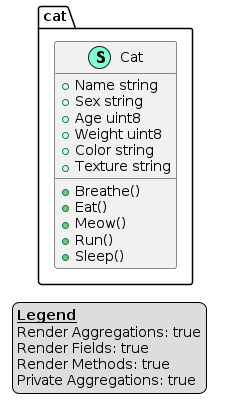

# OOP 面向对象程序设计

基本理念是将数据块及数据相关的行为封装成为特殊的、名为**对象**的实体，同时对象实体的生成工作则是基于程序员给出的一系列`蓝图`，这些`蓝图`就是**类**。

## 类和对象

### 类


在 go 语言中通过结构体定义**类**

```go
//dive-into-design-patterns/ch1-oop/cat/cat.go
// Cat 猫，类
type Cat struct {
	Name    string // 名字
	Sex     string // 性别
	Age     uint8  // 年龄
	Weight  uint8  // 体重
	Color   string // 毛色
	Texture string // 纹理
}

// Breathe 呼吸
func (c Cat) Breathe() {}

// Eat 吃
func (c Cat) Eat() {}

// Meow 喵
func (c Cat) Meow() {}

// Run 跑
func (c Cat) Run() {}

// Sleep 睡觉
func (c Cat) Sleep() {}
```

结构体 `Cat` 中的字段（Name、Sex 等）是该类的**成员变量**

结构体 `Cat` 中的方法（Eat、Meow 等）是该类的**方法**

**成员变量**和**方法**可以统称为类的**成员**




### 实例

**对象是类的实例**

```go
//dive-into-design-patterns/ch1-oop/cat/example/main.go
func main() {
	var kaka = cat.Cat{
		Name:    "卡卡",
		Sex:     "男孩",
		Age:     3,
		Weight:  7,
		Color:   "棕色",
		Texture: "条纹",
	}
	var lulu = cat.Cat{
		Name:    "露露",
		Sex:     "女孩",
		Age:     2,
		Weight:  5,
		Color:   "灰色",
		Texture: "纯色",
	}
	fmt.Printf("KaKa:%+v\n", kaka)
	fmt.Printf("LuLu:%+v\n", lulu)
}
```

`kaka` 和 `lulu` 是 `Cat` 的实例。

### 类层次结构

一些类可能会组织起来形成**类层次结构**。

狗和猫有很多相同的地方，比如名字、性别、年龄和毛色等属性。狗和猫一样可以呼吸、睡觉和奔跑。


可以定义一个 `Animal` **超类**

```go
//dive-into-design-patterns/ch1-oop/animal/animal.go
type Animal struct {
	Name   string // 名字
	Sex    string // 性别
	Age    uint8  // 年龄
	Weight uint8  // 体重
	Color  string // 毛色
}

// Breathe 呼吸
func (a Animal) Breathe() {}

// Eat 吃
func (a Animal) Eat() {}

// Run 跑
func (a Animal) Run() {}

// Sleep 睡觉
func (a Animal) Sleep() {}

```

**继承**它的类被称为 **子类**（在 go 语言中没有关于**继承**的关键字）

子类会继承其父类的状态和行为（在 go 语言中不能访问其他包中的类的私有属性、私有方法）

```go
//dive-into-design-patterns/ch1-oop/animal/cat/cat.go
type Cat struct {
	*animal.Animal

	isNasty bool
}

func (c *Cat) Meow() {}

```

```go
//dive-into-design-patterns/ch1-oop/animal/dog/dog.go
type Dog struct {
	*animal.Animal

	bestFriend string
}

func (d *Dog) Bark() {}

```

类层次结构的 UML 图


子类可以对从父类中继承而来的方法的行为进行重写。

## 抽象、封装、继承、多态

### 抽象

根据真实世界对象来设计程序中的对象，但程序中的对象大部分情况下只需**模拟**真实对象的特定属性和行为，而不需要能够完全准确地反映原型。

比如，`飞行模拟器`和`航班预订程序`中都可能包含飞机  `Airplane` 类。

- 飞行模拟器需要包含与实际飞行相关的详细信息
- 航班预订程序只关系座位图和哪些座位可供预订


### 封装

对其他对象隐藏其部分状态和行为，而仅向程序其他部分暴露有限的接口的能力。

如果想要启动一辆车的发动机，你只需按下按钮即可，无需打开引擎盖手动接线、转动曲轴和气缸并启动发动机的动力循环。这些细节都隐藏在引擎盖下，你只会看到一些简单的接口：启动开关、方向盘等。

在 go 语言中通过方法名首字母小写的方式进行“隐藏”。

接口仅关心对象行为，在 go 语言中通过 `interface` 定义接口。


代码见 `dive-into-design-patterns/ch1-oop/encapsulation`

航空运输 `FlyingTransport` 接口定义

```go
type FlyingTransport interface {
	Fly(origin string, destination string, passengers string)
}
```

机场 `Airport` 类

```go
type Airport struct{}

func NewAirport() *Airport {
	return &Airport{}
}

func (a *Airport) Accept(vehicle flyingtransport.FlyingTransport) {}
```

飞机 `Airplane`

```go
type Airplane struct{}

func (a *Airplane) Fly(origin string, destination string, passengers string) {}
```

直升机 `Helicopter`

```go
type Helicopter struct{}

func (h *Helicopter) Fly(origin string, destination string, passengers string) {}
```


### 继承

**继承**是指在根据已有类创建新类的能力。

在 go 语言中没有继承相关的关键字。

[示例](#类层次结构) 

### 多态

多态是指程序能够检查对象所属的实际类，并在当前上下文不知道其真实类型的情况下调用其实现的能力。


```go
type Animal interface {
	MakeSound()
}

type Cat struct{}

func (c Cat) MakeSound() {
	fmt.Println("喵喵！")
}

type Dog struct{}

func (d *Dog) MakeSound() {
	fmt.Println("汪汪！")
}
```


