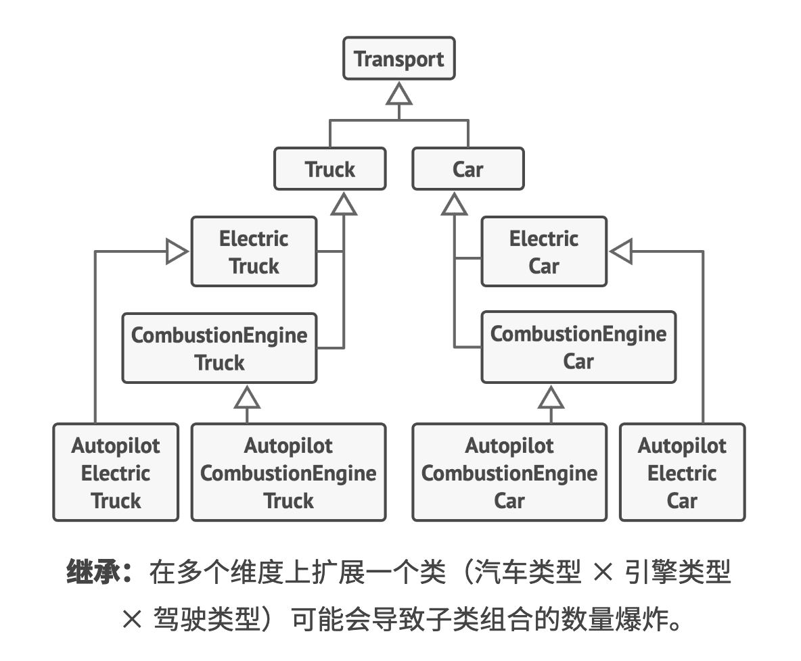
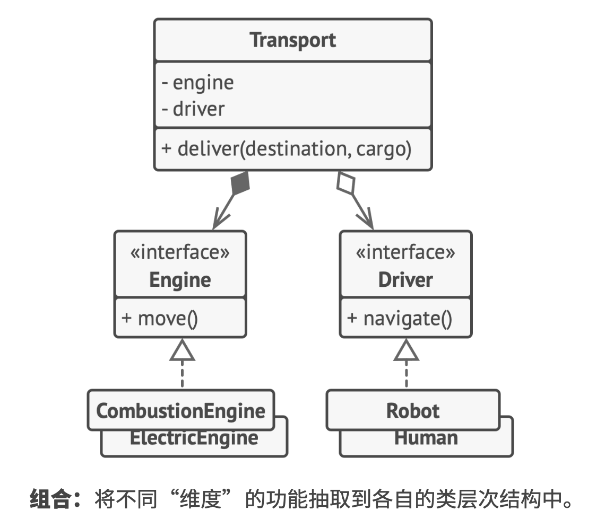
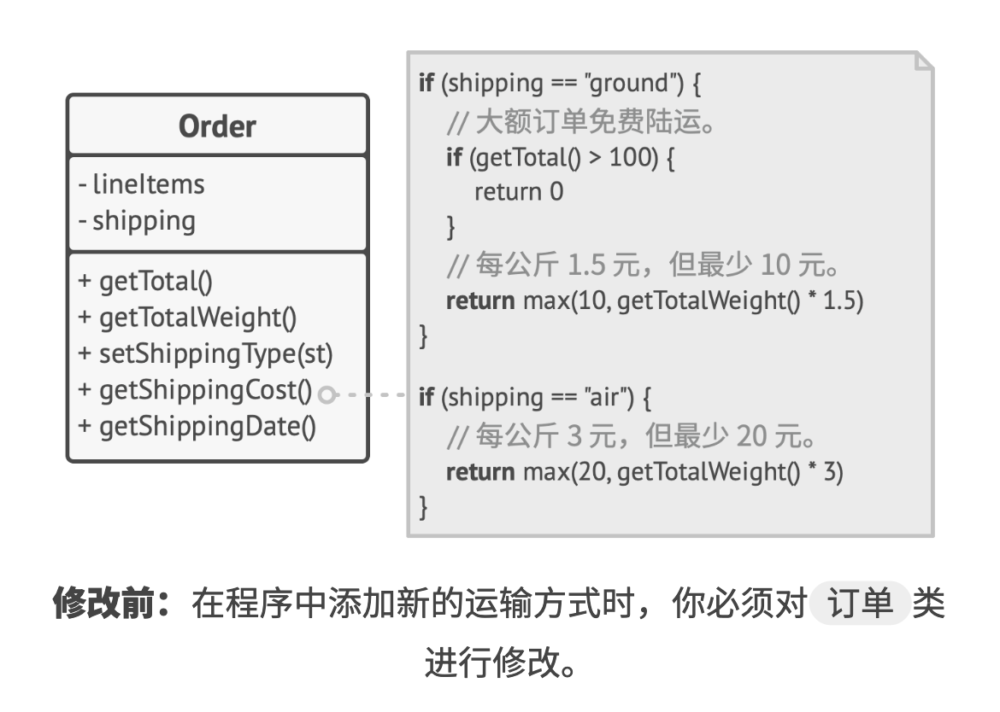
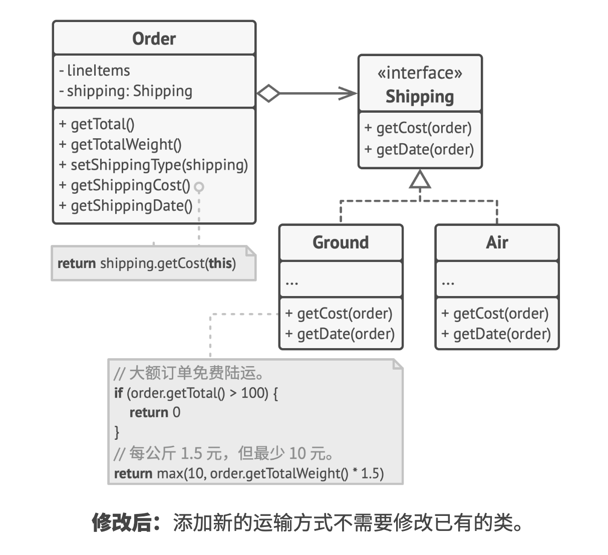
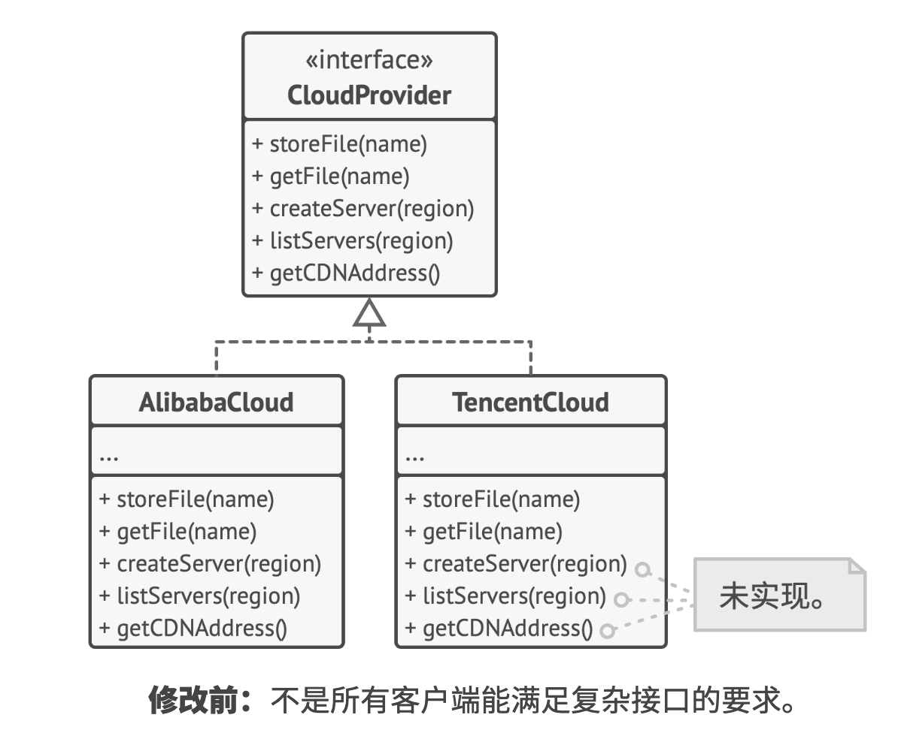
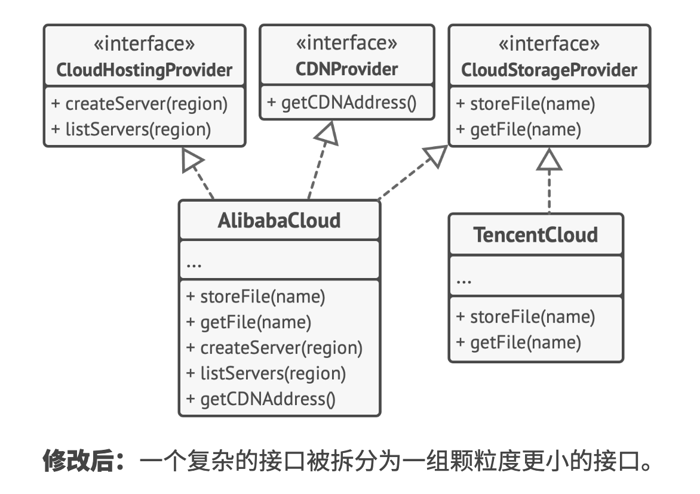
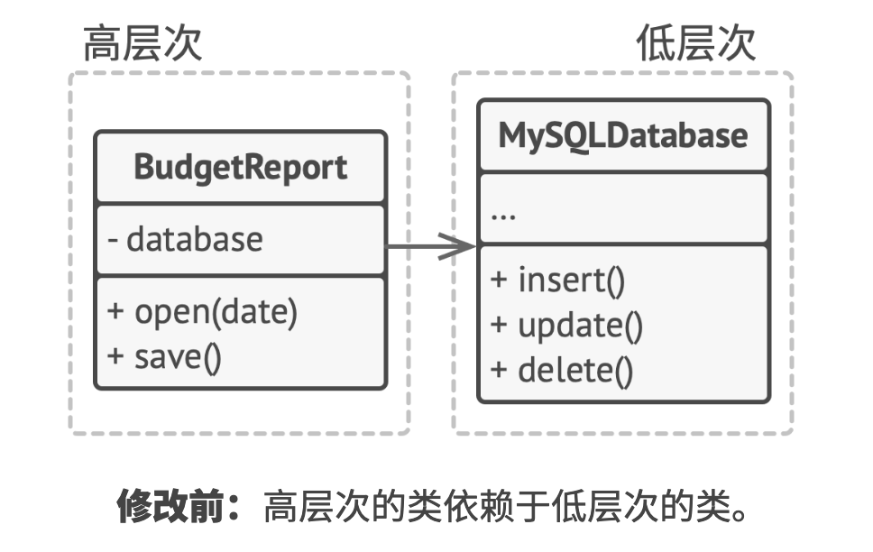
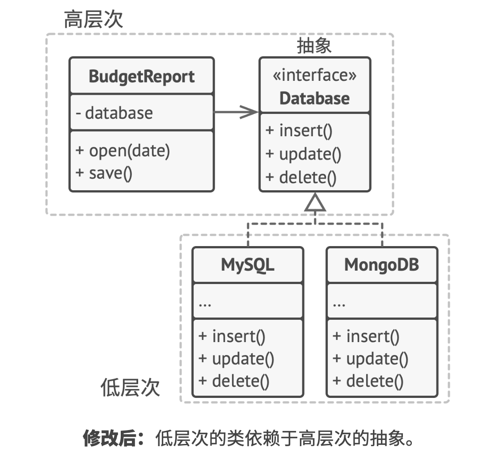

# 软件设计原则

## 优秀设计的特征

### 代码复用

无论是开发何种软件产品，成本和时间都是最重要的两个维度。

**代码复用**是减少开发成本时最常用的方式之一。

设计模式创始人之一的**埃里希 伽玛**认为复用有三层：

- 最底层：复用类（类库、容器及一些类的组合等等）
- 中间层：设计模式。比框架更小且更抽象，它们实际上是对一组类的关系及其互动方式的描述。
- 最高层：框架。用于精简自己的设计，可以用于明确解决问题所需的抽象概念，然后用类来表示这些概念并定义其关系。

**当你从类转向模式，并最终到达框架的过程中，复用程度会不断增加**

### 扩展性

**变化**是程序员生命中唯一不变的事情。

在设计程序架构时，所有有经验的开发者会尽量选择支持未来任何可能变更的方式。

## 设计原则

### 封装变化的内容

**找到程序中变化内容并将其与不变的内容区分开**

该原则的主要目的是将变更造成的影响最小化。

将变化部分放入对立的模块中，保护其他代码不受负面影响。

### 面向接口进行开发，而不是面向实现

**面向接口进行开发，而不是面向实现；依赖于抽象类型，而不是具体类**

如果无需修改已有代码就能轻松对类进行扩展，那就可以说这样的设计是灵活的。

### 组合优于继承

继承可能是类之间最明显、最简便的代码复用方式。

（如果你的代码有相同的类，就可以为它们创建一个通用的基类，然后将相似的代码移动到其中）

继承的问题清单：

- **子类不能减少超类的接口**。必须实现父类中所有的抽象方法。
- **在重写方法时，你需要确保新行为与其基类中的版本兼容**。因为子类的成员都可能被传递给以超类对象为参数的任何代码，若不兼容将会导致这些代码崩溃。
- **继承打破了超类的封装**，因为子类拥有访问父类内部详细内容的权限。
- **子类与超类紧密耦合**。超类中的任何修改都可能会破坏子类的功能。
- **通过继承复用代码可能导致平行继承体系的产生**。继承通常仅发生在一个维度中。只要出现了两个以上的维度，你就必须创建数量巨大的类组合，从而使类层次结构膨胀到不可思议的程度。

**组合**时替代**继承**的一种方法。继承代表类之间的`是`关系，组合代码类之间的`有`关系。

某公司同时生产汽车 `Car` 和卡车 `Truck`，车辆可能是电动车 `Electric` 或汽油车 `Combustion`；所有车型都配备了手动控制 `manual control` 或自动驾驶 `Autopilot` 功能。

使用组合，汽车对象可将行为委派给其他对象，而不是自行实现。

## SOLID 原则

在**罗比特 C 马丁（鲍勃大叔）**的《敏捷软件开发》中首次提出了名为 `SOLID` 的五条原则。

这五条原则是：

- S（单一职责原则，Single Responsibility Principle）：修改一个类的原因只能有一个。
- O（开闭原则，Open/closed Principle）：对于扩展，“类”应该是“开放”的，对于修改，类则应该是“封闭”的。
- L（里氏替换原则，Liskov Substitution Principle）：当你扩展一个类时，记住你应该要能在不修改客户端代码的情况下将子类的对象作为父类对象进行传递。
- I（接口隔离原则，Interface Segregation Principle）：客户端不应被强迫依赖于其不使用的方法。
- D（依赖倒置原则，Dependency Inversion Principle）：高层次的类不应依赖于低层次的类。两者都应该依赖于具体接口。抽象接口不应依赖于具体实现。具体实现应该依赖于抽象接口。

与生活中所有事情一样，盲目遵守这些原则可能会弊大于利。

在程序架构中应用这些原则可能会使其变得过于复杂。

有原则是件好事，但是也要时刻从实用的角度来考量，不要把这里的每句话当作放之四海皆准的教条。

### 单一职责原则

**修改一个类的原因只能有一个**

尽量让每个类只负责软件中的一个功能，并将该功能完全封装在该类中。

如果类负责的东西太多，那么当其中任何一件事情发生改变时，你都必须对类进行修改。而进行修改时，你就有可能改动类中自己并不希望改动的部分。

当程序规模不断扩大、变更不断增加后，真实问题才会逐渐显现出来。到了某个时候，类会变得过于庞大，以至于你无法记住其细节。查找代码将变得非常缓慢，你必须浏览整个类，甚至整个程序才能找到需要的东西。

（案例可以看 [开闭原则](#开闭原则) 部分，Shipping 接口就是单一职责原则优化的体现）

### 开闭原则

**对于扩展，“类”应该是“开放”的，对于修改，类则应该是“封闭”的**

本原则的主要理念是在实现新功能时能保持已有代码不变。

如果你对一个类进行扩展，可以创建它的子类并对其做任何事情（如新增方法或成员变量、重写基类行为等），那么他就是开放的。

如果某个类已经做了充分的准备并可供其他类使用的话（即其接口已明确定义且以后不会修改），那么该类就是封闭的（你可以称之为完整）的。

如果一个类已经完成开发、测试和审核工作，而且属于某个框架或者可被其他类的代码直接使用的话，对其代码进行修改就是有风险的。你可以创建一个子类并重写原始类的部分内容以完成不同的行为，而不是直接对原始类的代码进行修改。这样你既可以达成自己的目标，但同时又无需修改已有的原始类客户端。（这条原则并不能应用于所有对类进行的修改中。如果你发现类中存在缺陷，直接对其进行修复即可，不要为它创建子类。子类不应该对其父类的问题负责。）

将运输方法抽取到拥有同样接口的不同类中。

在需要实现一个新的运输方式时，你可以通过扩展 `运输方式 Shipping` 接口来新建一个类，无需修改任何 `订单` 类的代码。

（根据单一职责原则，这个解决方案能够让你将运输时间的计算代码移动到与其相关度更高的类中）

### 里氏替换原则

**当你扩展一个类时，记住你应该要能在不修改客户端代码的情况下将子类的对象作为父类对象进行传递**

这意味着子类必须保持与父类行为的兼容（得向前兼容，不需要使用这个类的用户修改任何代码仍然能够像以前一样工作）

**里氏替换原则**在开发程序库和框架时非常重要，因为其中的类将会在他人的代码中使用，你是无法直接访问和修改这些代码的。

### 接口隔离原则

**客户端不应被强迫依赖于其不使用的方法**

尽量缩小接口的范围，使得客户端的类不必实现其不需要的行为。

所定义的接口可能不是所有客户端都能满足的。

接口不是越多越好，需要结合业务适当拆分，创建的接口越多代码就越复杂。

### 依赖倒置原则

**高层次的类不应依赖于低层次的类。两者都应该依赖于具体接口。抽象接口不应依赖于具体实现。具体实现应该依赖于抽象接口**

通常在设计软件时，你可以识别出不同层次的类。

- **低层次的类**：实现基础的操作（例如磁盘操作、传输网络数据和连接数据库等）。
- **高层次类**：包含复杂业务逻辑以指导低层次类执行特定操作。

高层次的类不应关注数据存储的细节。

其结果是原始的依赖关系被倒置。