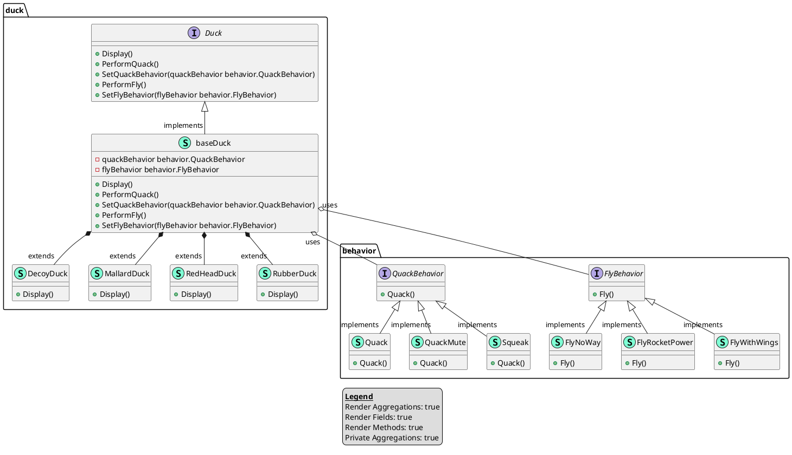

# Strategy 策略模式

策略模式定义了一个算法族，分别封装起来，使得它们之间可以互相变换。策略让算法的变化独立于使用它的客户。

## plantuml

```plantuml
@startuml
legend
<u><b>Legend</b></u>
Render Aggregations: true
Render Fields: true
Render Methods: true
Private Aggregations: true
end legend
namespace behavior {
    interface FlyBehavior  {
        + Fly() 

    }
    class FlyNoWay << (S,Aquamarine) >> {
        + Fly() 

    }
    class FlyRocketPower << (S,Aquamarine) >> {
        + Fly() 

    }
    class FlyWithWings << (S,Aquamarine) >> {
        + Fly() 

    }
    class Quack << (S,Aquamarine) >> {
        + Quack() 

    }
    interface QuackBehavior  {
        + Quack() 

    }
    class QuackMute << (S,Aquamarine) >> {
        + Quack() 

    }
    class Squeak << (S,Aquamarine) >> {
        + Quack() 

    }
}

"behavior.FlyBehavior" <|-- "implements""behavior.FlyNoWay"
"behavior.FlyBehavior" <|-- "implements""behavior.FlyRocketPower"
"behavior.FlyBehavior" <|-- "implements""behavior.FlyWithWings"
"behavior.QuackBehavior" <|-- "implements""behavior.Quack"
"behavior.QuackBehavior" <|-- "implements""behavior.QuackMute"
"behavior.QuackBehavior" <|-- "implements""behavior.Squeak"


namespace duck {
    class DecoyDuck << (S,Aquamarine) >> {
        + Display() 

    }
    interface Duck  {
        + Display() 
        + PerformQuack() 
        + SetQuackBehavior(quackBehavior behavior.QuackBehavior) 
        + PerformFly() 
        + SetFlyBehavior(flyBehavior behavior.FlyBehavior) 

    }
    class MallardDuck << (S,Aquamarine) >> {
        + Display() 

    }
    class RedHeadDuck << (S,Aquamarine) >> {
        + Display() 

    }
    class RubberDuck << (S,Aquamarine) >> {
        + Display() 

    }
    class baseDuck << (S,Aquamarine) >> {
        - quackBehavior behavior.QuackBehavior
        - flyBehavior behavior.FlyBehavior

        + Display() 
        + PerformQuack() 
        + SetQuackBehavior(quackBehavior behavior.QuackBehavior) 
        + PerformFly() 
        + SetFlyBehavior(flyBehavior behavior.FlyBehavior) 

    }
}
"duck.baseDuck" *-- "extends""duck.DecoyDuck"
"duck.baseDuck" *-- "extends""duck.MallardDuck"
"duck.baseDuck" *-- "extends""duck.RedHeadDuck"
"duck.baseDuck" *-- "extends""duck.RubberDuck"

"duck.Duck" <|-- "implements""duck.baseDuck"

"duck.baseDuck""uses" o-- "behavior.FlyBehavior"
"duck.baseDuck""uses" o-- "behavior.QuackBehavior"

@enduml
```

