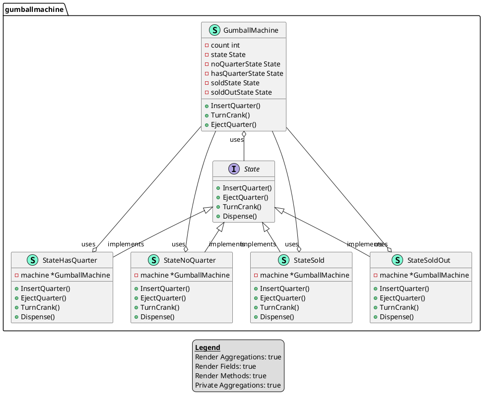
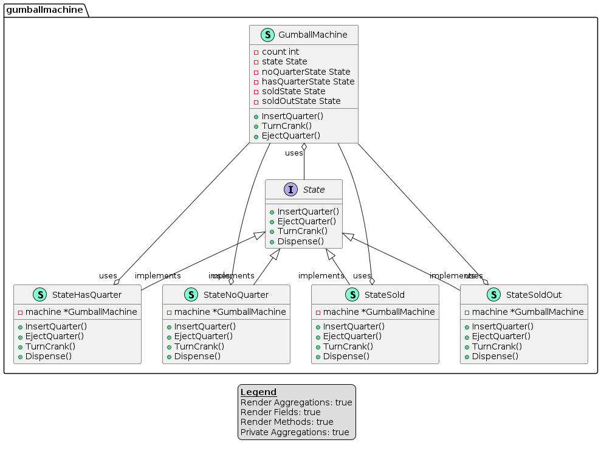

# State 状态模式

状态模式允许对象在内部状态改变时改变其行为。对象看起来好像改变了它的类。

## plantuml

```plantuml
@startuml
legend
<u><b>Legend</b></u>
Render Aggregations: true
Render Fields: true
Render Methods: true
Private Aggregations: true
end legend
namespace gumballmachine {
    class GumballMachine << (S,Aquamarine) >> {
        - count int
        - state State
        - noQuarterState State
        - hasQuarterState State
        - soldState State
        - soldOutState State

        + InsertQuarter() 
        + TurnCrank() 
        + EjectQuarter() 

    }
    interface State  {
        + InsertQuarter() 
        + EjectQuarter() 
        + TurnCrank() 
        + Dispense() 

    }
    class StateHasQuarter << (S,Aquamarine) >> {
        - machine *GumballMachine

        + InsertQuarter() 
        + EjectQuarter() 
        + TurnCrank() 
        + Dispense() 

    }
    class StateNoQuarter << (S,Aquamarine) >> {
        - machine *GumballMachine

        + InsertQuarter() 
        + EjectQuarter() 
        + TurnCrank() 
        + Dispense() 

    }
    class StateSold << (S,Aquamarine) >> {
        - machine *GumballMachine

        + InsertQuarter() 
        + EjectQuarter() 
        + TurnCrank() 
        + Dispense() 

    }
    class StateSoldOut << (S,Aquamarine) >> {
        - machine *GumballMachine

        + InsertQuarter() 
        + EjectQuarter() 
        + TurnCrank() 
        + Dispense() 

    }
}

"gumballmachine.State" <|-- "implements""gumballmachine.StateHasQuarter"
"gumballmachine.State" <|-- "implements""gumballmachine.StateNoQuarter"
"gumballmachine.State" <|-- "implements""gumballmachine.StateSold"
"gumballmachine.State" <|-- "implements""gumballmachine.StateSoldOut"

"gumballmachine.GumballMachine""uses" o-- "gumballmachine.State"
"gumballmachine.StateHasQuarter""uses" o-- "gumballmachine.GumballMachine"
"gumballmachine.StateNoQuarter""uses" o-- "gumballmachine.GumballMachine"
"gumballmachine.StateSold""uses" o-- "gumballmachine.GumballMachine"
"gumballmachine.StateSoldOut""uses" o-- "gumballmachine.GumballMachine"

@enduml
```

