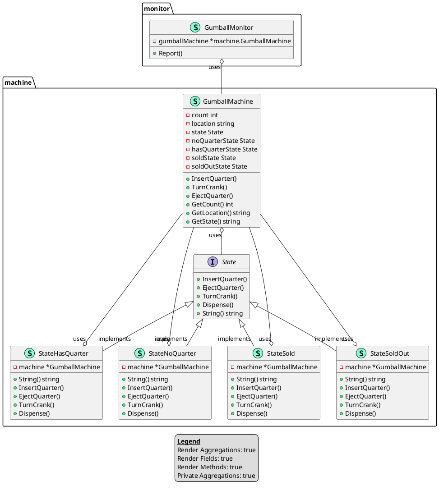
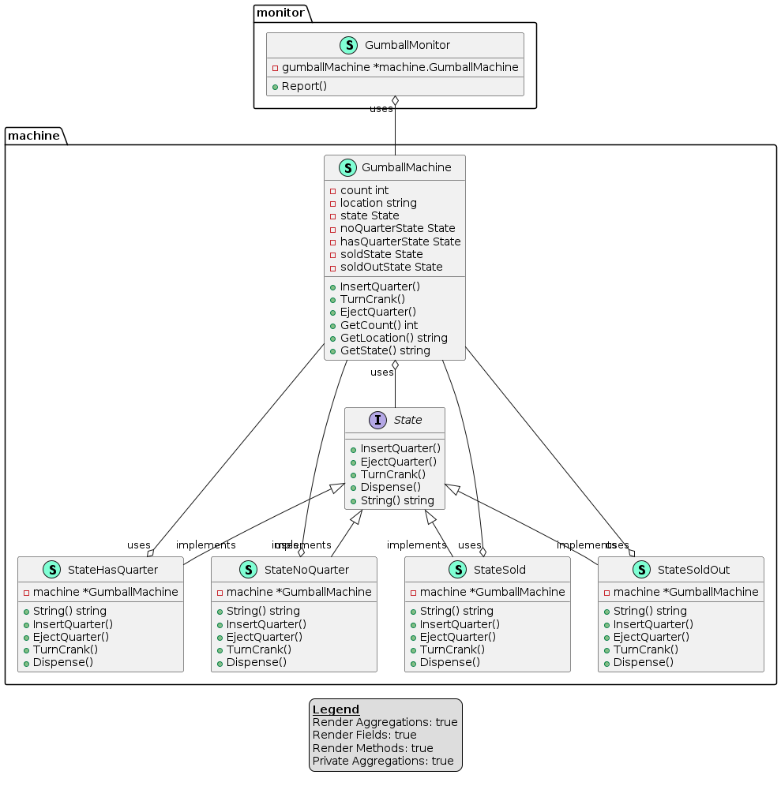

# Proxy 代理模式

代理模式为另一个对象提供一个替身或占位符来控制对这个对象的访问。

使用代理模式创建代表对象。代表对象控制对另一个对象的访问，被代表的对象可以是远程的对象、创建开销大的对象或需要安全控制的对象。

## plantuml

```plantuml
@startuml
legend
<u><b>Legend</b></u>
Render Aggregations: true
Render Fields: true
Render Methods: true
Private Aggregations: true
end legend
namespace machine {
    class GumballMachine << (S,Aquamarine) >> {
        - count int
        - location string
        - state State
        - noQuarterState State
        - hasQuarterState State
        - soldState State
        - soldOutState State

        + InsertQuarter() 
        + TurnCrank() 
        + EjectQuarter() 
        + GetCount() int
        + GetLocation() string
        + GetState() string

    }
    interface State  {
        + InsertQuarter() 
        + EjectQuarter() 
        + TurnCrank() 
        + Dispense() 
        + String() string

    }
    class StateHasQuarter << (S,Aquamarine) >> {
        - machine *GumballMachine

        + String() string
        + InsertQuarter() 
        + EjectQuarter() 
        + TurnCrank() 
        + Dispense() 

    }
    class StateNoQuarter << (S,Aquamarine) >> {
        - machine *GumballMachine

        + String() string
        + InsertQuarter() 
        + EjectQuarter() 
        + TurnCrank() 
        + Dispense() 

    }
    class StateSold << (S,Aquamarine) >> {
        - machine *GumballMachine

        + String() string
        + InsertQuarter() 
        + EjectQuarter() 
        + TurnCrank() 
        + Dispense() 

    }
    class StateSoldOut << (S,Aquamarine) >> {
        - machine *GumballMachine

        + String() string
        + InsertQuarter() 
        + EjectQuarter() 
        + TurnCrank() 
        + Dispense() 

    }
}

"machine.State" <|-- "implements""machine.StateHasQuarter"
"machine.State" <|-- "implements""machine.StateNoQuarter"
"machine.State" <|-- "implements""machine.StateSold"
"machine.State" <|-- "implements""machine.StateSoldOut"

"machine.GumballMachine""uses" o-- "machine.State"
"machine.StateHasQuarter""uses" o-- "machine.GumballMachine"
"machine.StateNoQuarter""uses" o-- "machine.GumballMachine"
"machine.StateSold""uses" o-- "machine.GumballMachine"
"machine.StateSoldOut""uses" o-- "machine.GumballMachine"

namespace monitor {
    class GumballMonitor << (S,Aquamarine) >> {
        - gumballMachine *machine.GumballMachine

        + Report() 

    }
}


"monitor.GumballMonitor""uses" o-- "machine.GumballMachine"

@enduml
```

