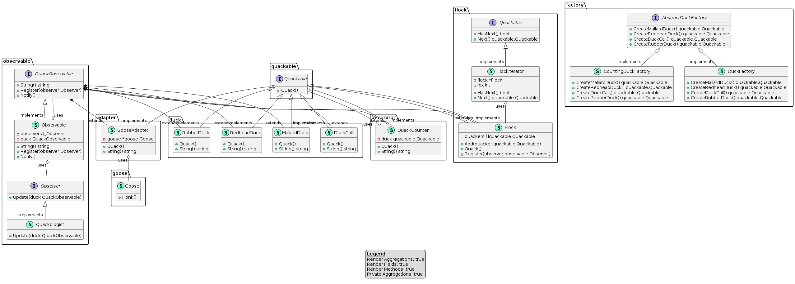

# Compound 复合模式

模式通常被一起使用，并结合在同一个设计解决方案中。

复合模式在一个解决方案中结合两个或多个模式，以解决一般的或重复发生的问题。

## plantuml

```plantuml
@startuml
legend
<u><b>Legend</b></u>
Render Aggregations: true
Render Fields: true
Render Methods: true
Private Aggregations: true
end legend
namespace adapter {
    class GooseAdapter << (S,Aquamarine) >> {
        - goose *goose.Goose

        + Quack() 
        + String() string

    }
}
"observable.QuackObservable" *-- "extends""adapter.GooseAdapter"

"quackable.Quackable" <|-- "implements""adapter.GooseAdapter"

"adapter.GooseAdapter""uses" o-- "goose.Goose"

namespace decorator {
    class QuackCounter << (S,Aquamarine) >> {
        - duck quackable.Quackable

        + Quack() 
        + String() string

    }
}
"observable.QuackObservable" *-- "extends""decorator.QuackCounter"

"quackable.Quackable" <|-- "implements""decorator.QuackCounter"

"decorator.QuackCounter""uses" o-- "quackable.Quackable"

namespace duck {
    class DuckCall << (S,Aquamarine) >> {
        + Quack() 
        + String() string

    }
    class MallardDuck << (S,Aquamarine) >> {
        + Quack() 
        + String() string

    }
    class RedheadDuck << (S,Aquamarine) >> {
        + Quack() 
        + String() string

    }
    class RubberDuck << (S,Aquamarine) >> {
        + Quack() 
        + String() string

    }
}
"observable.QuackObservable" *-- "extends""duck.DuckCall"
"observable.QuackObservable" *-- "extends""duck.MallardDuck"
"observable.QuackObservable" *-- "extends""duck.RedheadDuck"
"observable.QuackObservable" *-- "extends""duck.RubberDuck"

"quackable.Quackable" <|-- "implements""duck.DuckCall"
"quackable.Quackable" <|-- "implements""duck.MallardDuck"
"quackable.Quackable" <|-- "implements""duck.RedheadDuck"
"quackable.Quackable" <|-- "implements""duck.RubberDuck"


namespace factory {
    interface AbstractDuckFactory  {
        + CreateMallardDuck() quackable.Quackable
        + CreateRedheadDuck() quackable.Quackable
        + CreateDuckCall() quackable.Quackable
        + CreateRubberDuck() quackable.Quackable

    }
    class CountingDuckFactory << (S,Aquamarine) >> {
        + CreateMallardDuck() quackable.Quackable
        + CreateRedheadDuck() quackable.Quackable
        + CreateDuckCall() quackable.Quackable
        + CreateRubberDuck() quackable.Quackable

    }
    class DuckFactory << (S,Aquamarine) >> {
        + CreateMallardDuck() quackable.Quackable
        + CreateRedheadDuck() quackable.Quackable
        + CreateDuckCall() quackable.Quackable
        + CreateRubberDuck() quackable.Quackable

    }
}

"factory.AbstractDuckFactory" <|-- "implements""factory.CountingDuckFactory"
"factory.AbstractDuckFactory" <|-- "implements""factory.DuckFactory"


namespace flock {
    class Flock << (S,Aquamarine) >> {
        - quackers []quackable.Quackable

        + Add(quacker quackable.Quackable) 
        + Quack() 
        + Register(observer observable.Observer) 

    }
    class FlockIterator << (S,Aquamarine) >> {
        - flock *Flock
        - idx int

        + HasNext() bool
        + Next() quackable.Quackable

    }
    interface Quackable  {
        + HasNext() bool
        + Next() quackable.Quackable

    }
}
"observable.QuackObservable" *-- "extends""flock.Flock"

"quackable.Quackable" <|-- "implements""flock.Flock"
"flock.Quackable" <|-- "implements""flock.FlockIterator"

"flock.Flock""uses" o-- "quackable.Quackable"
"flock.FlockIterator""uses" o-- "flock.Flock"

namespace goose {
    class Goose << (S,Aquamarine) >> {
        + Honk() 

    }
}


namespace observable {
    class Observable << (S,Aquamarine) >> {
        - observers []Observer
        - duck QuackObservable

        + String() string
        + Register(observer Observer) 
        + Notify() 

    }
    interface Observer  {
        + Update(duck QuackObservable) 

    }
    interface QuackObservable  {
        + String() string
        + Register(observer Observer) 
        + Notify() 

    }
    class Quackologist << (S,Aquamarine) >> {
        + Update(duck QuackObservable) 

    }
}

"observable.QuackObservable" <|-- "implements""observable.Observable"
"observable.Observer" <|-- "implements""observable.Quackologist"

"observable.Observable""uses" o-- "observable.Observer"
"observable.Observable""uses" o-- "observable.QuackObservable"

namespace quackable {
    interface Quackable  {
        + Quack() 

    }
}


@enduml
```

