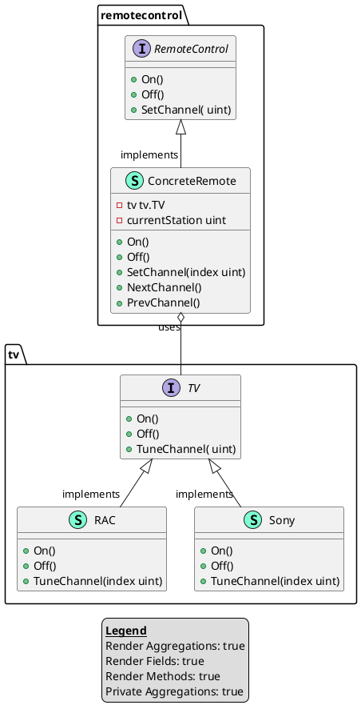
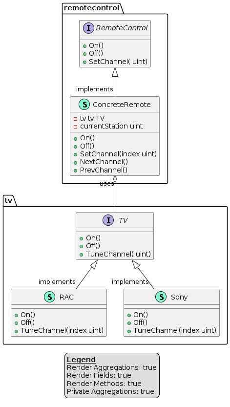

# Bridge 桥接模式

使用桥接模式不只改变你的实现，也改变你的抽象

## PlantUML

```plantuml
@startuml
legend
<u><b>Legend</b></u>
Render Aggregations: true
Render Fields: true
Render Methods: true
Private Aggregations: true
end legend
namespace remotecontrol {
    class ConcreteRemote << (S,Aquamarine) >> {
        - tv tv.TV
        - currentStation uint

        + On() 
        + Off() 
        + SetChannel(index uint) 
        + NextChannel() 
        + PrevChannel() 

    }
    interface RemoteControl  {
        + On() 
        + Off() 
        + SetChannel( uint) 

    }
}

"remotecontrol.RemoteControl" <|-- "implements""remotecontrol.ConcreteRemote"

"remotecontrol.ConcreteRemote""uses" o-- "tv.TV"

namespace tv {
    class RAC << (S,Aquamarine) >> {
        + On() 
        + Off() 
        + TuneChannel(index uint) 

    }
    class Sony << (S,Aquamarine) >> {
        + On() 
        + Off() 
        + TuneChannel(index uint) 

    }
    interface TV  {
        + On() 
        + Off() 
        + TuneChannel( uint) 

    }
}

"tv.TV" <|-- "implements""tv.RAC"
"tv.TV" <|-- "implements""tv.Sony"


@enduml
```

