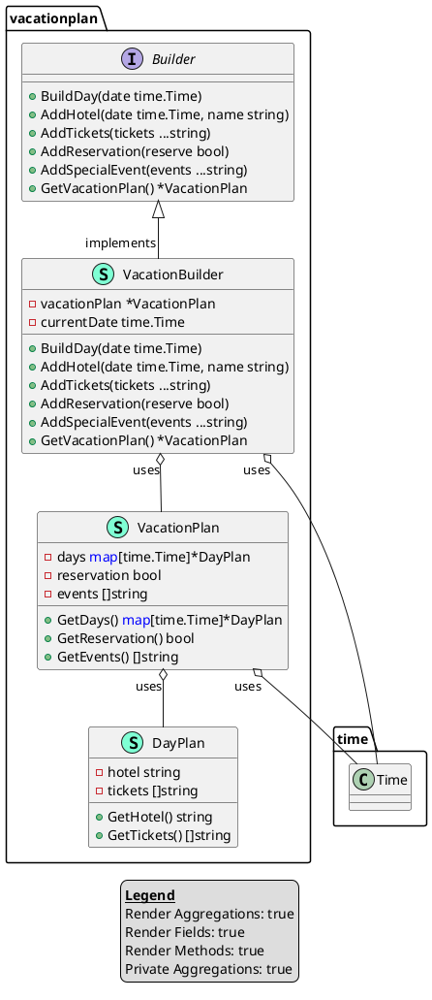
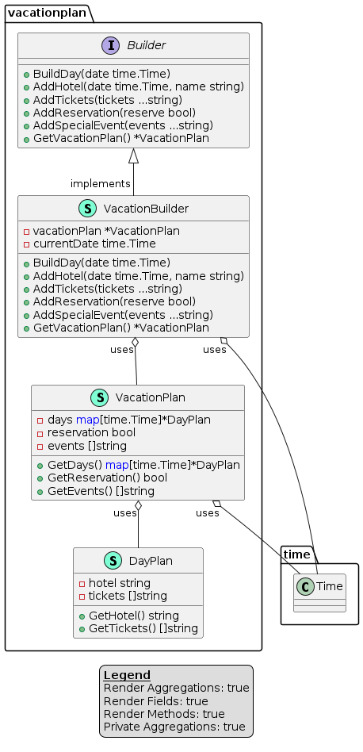

# Builder 生成器模式

使用生成器模式来封装一个产品的构造过程，并允许按步骤构造

## PlantUML

```plantuml
@startuml
legend
<u><b>Legend</b></u>
Render Aggregations: true
Render Fields: true
Render Methods: true
Private Aggregations: true
end legend
namespace vacationplan {
    interface Builder  {
        + BuildDay(date time.Time) 
        + AddHotel(date time.Time, name string) 
        + AddTickets(tickets ...string) 
        + AddReservation(reserve bool) 
        + AddSpecialEvent(events ...string) 
        + GetVacationPlan() *VacationPlan

    }
    class DayPlan << (S,Aquamarine) >> {
        - hotel string
        - tickets []string

        + GetHotel() string
        + GetTickets() []string

    }
    class VacationBuilder << (S,Aquamarine) >> {
        - vacationPlan *VacationPlan
        - currentDate time.Time

        + BuildDay(date time.Time) 
        + AddHotel(date time.Time, name string) 
        + AddTickets(tickets ...string) 
        + AddReservation(reserve bool) 
        + AddSpecialEvent(events ...string) 
        + GetVacationPlan() *VacationPlan

    }
    class VacationPlan << (S,Aquamarine) >> {
        - days <font color=blue>map</font>[time.Time]*DayPlan
        - reservation bool
        - events []string

        + GetDays() <font color=blue>map</font>[time.Time]*DayPlan
        + GetReservation() bool
        + GetEvents() []string

    }
}

"vacationplan.Builder" <|-- "implements""vacationplan.VacationBuilder"

"vacationplan.VacationBuilder""uses" o-- "time.Time"
"vacationplan.VacationBuilder""uses" o-- "vacationplan.VacationPlan"
"vacationplan.VacationPlan""uses" o-- "time.Time"
"vacationplan.VacationPlan""uses" o-- "vacationplan.DayPlan"

@enduml
```

