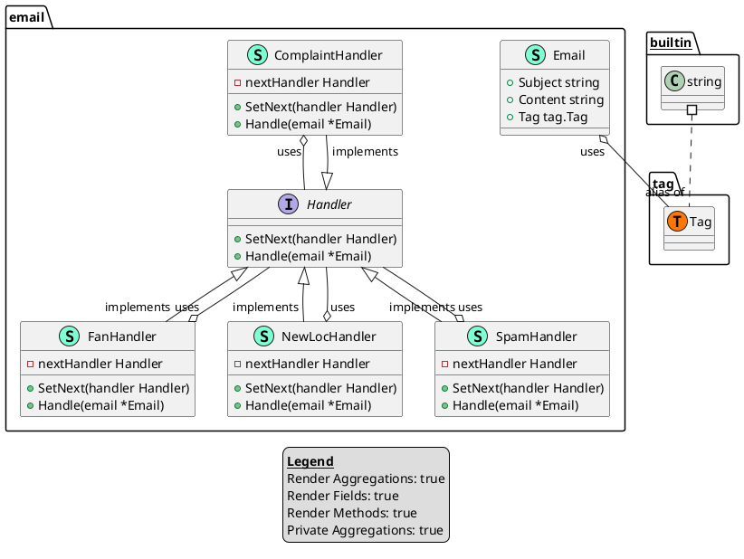
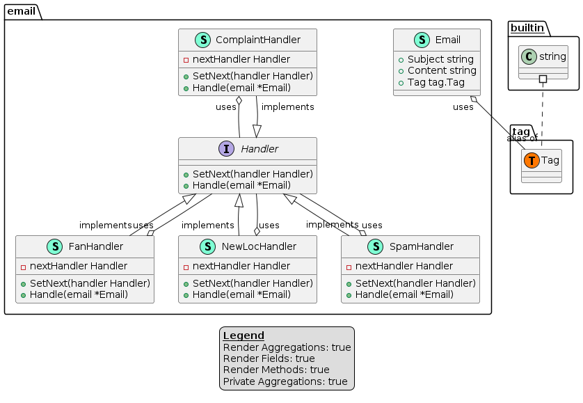

# Chain of Responsibility 责任链模式

当你要把一个处理请求的机会给予多于一个的对象时，使用责任链模式。

## PlantUML

```plantuml
@startuml
legend
<u><b>Legend</b></u>
Render Aggregations: true
Render Fields: true
Render Methods: true
Private Aggregations: true
end legend
namespace email {
    class ComplaintHandler << (S,Aquamarine) >> {
        - nextHandler Handler

        + SetNext(handler Handler) 
        + Handle(email *Email) 

    }
    class Email << (S,Aquamarine) >> {
        + Subject string
        + Content string
        + Tag tag.Tag

    }
    class FanHandler << (S,Aquamarine) >> {
        - nextHandler Handler

        + SetNext(handler Handler) 
        + Handle(email *Email) 

    }
    interface Handler  {
        + SetNext(handler Handler) 
        + Handle(email *Email) 

    }
    class NewLocHandler << (S,Aquamarine) >> {
        - nextHandler Handler

        + SetNext(handler Handler) 
        + Handle(email *Email) 

    }
    class SpamHandler << (S,Aquamarine) >> {
        - nextHandler Handler

        + SetNext(handler Handler) 
        + Handle(email *Email) 

    }
}

"email.Handler" <|-- "implements""email.ComplaintHandler"
"email.Handler" <|-- "implements""email.FanHandler"
"email.Handler" <|-- "implements""email.NewLocHandler"
"email.Handler" <|-- "implements""email.SpamHandler"

"email.ComplaintHandler""uses" o-- "email.Handler"
"email.Email""uses" o-- "tag.Tag"
"email.FanHandler""uses" o-- "email.Handler"
"email.NewLocHandler""uses" o-- "email.Handler"
"email.SpamHandler""uses" o-- "email.Handler"

namespace tag {
    class tag.Tag << (T, #FF7700) >>  {
    }
}


"__builtin__.string" #.. "alias of""tag.Tag"
@enduml
```

