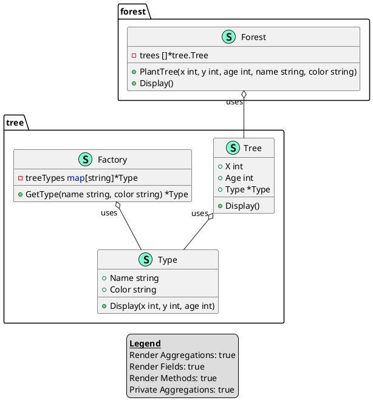

# Flyweight 蝇量模式

当某个类的一个实例可以用于提供许多虚拟实例时，使用蝇量。

## PlantUML

```plantuml
@startuml
legend
<u><b>Legend</b></u>
Render Aggregations: true
Render Fields: true
Render Methods: true
Private Aggregations: true
end legend
namespace forest {
    class Forest << (S,Aquamarine) >> {
        - trees []*tree.Tree

        + PlantTree(x int, y int, age int, name string, color string) 
        + Display() 

    }
}


"forest.Forest""uses" o-- "tree.Tree"

namespace tree {
    class Factory << (S,Aquamarine) >> {
        - treeTypes <font color=blue>map</font>[string]*Type

        + GetType(name string, color string) *Type

    }
    class Tree << (S,Aquamarine) >> {
        + X int
        + Age int
        + Type *Type

        + Display() 

    }
    class Type << (S,Aquamarine) >> {
        + Name string
        + Color string

        + Display(x int, y int, age int) 

    }
}


"tree.Factory""uses" o-- "tree.Type"
"tree.Tree""uses" o-- "tree.Type"

@enduml
```

