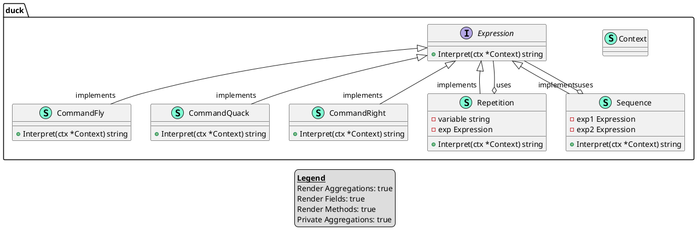
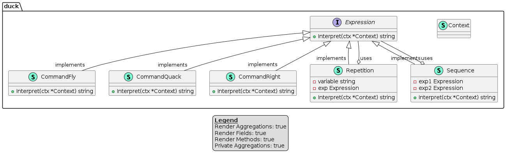

# Interpreter 解释器模式

使用解释器模式为语言建造解释器

## PlantUML

```plantuml
@startuml
legend
<u><b>Legend</b></u>
Render Aggregations: true
Render Fields: true
Render Methods: true
Private Aggregations: true
end legend
namespace duck {
    class CommandFly << (S,Aquamarine) >> {
        + Interpret(ctx *Context) string

    }
    class CommandQuack << (S,Aquamarine) >> {
        + Interpret(ctx *Context) string

    }
    class CommandRight << (S,Aquamarine) >> {
        + Interpret(ctx *Context) string

    }
    class Context << (S,Aquamarine) >> {
    }
    interface Expression  {
        + Interpret(ctx *Context) string

    }
    class Repetition << (S,Aquamarine) >> {
        - variable string
        - exp Expression

        + Interpret(ctx *Context) string

    }
    class Sequence << (S,Aquamarine) >> {
        - exp1 Expression
        - exp2 Expression

        + Interpret(ctx *Context) string

    }
}

"duck.Expression" <|-- "implements""duck.CommandFly"
"duck.Expression" <|-- "implements""duck.CommandQuack"
"duck.Expression" <|-- "implements""duck.CommandRight"
"duck.Expression" <|-- "implements""duck.Repetition"
"duck.Expression" <|-- "implements""duck.Sequence"

"duck.Repetition""uses" o-- "duck.Expression"
"duck.Sequence""uses" o-- "duck.Expression"

@enduml
```

