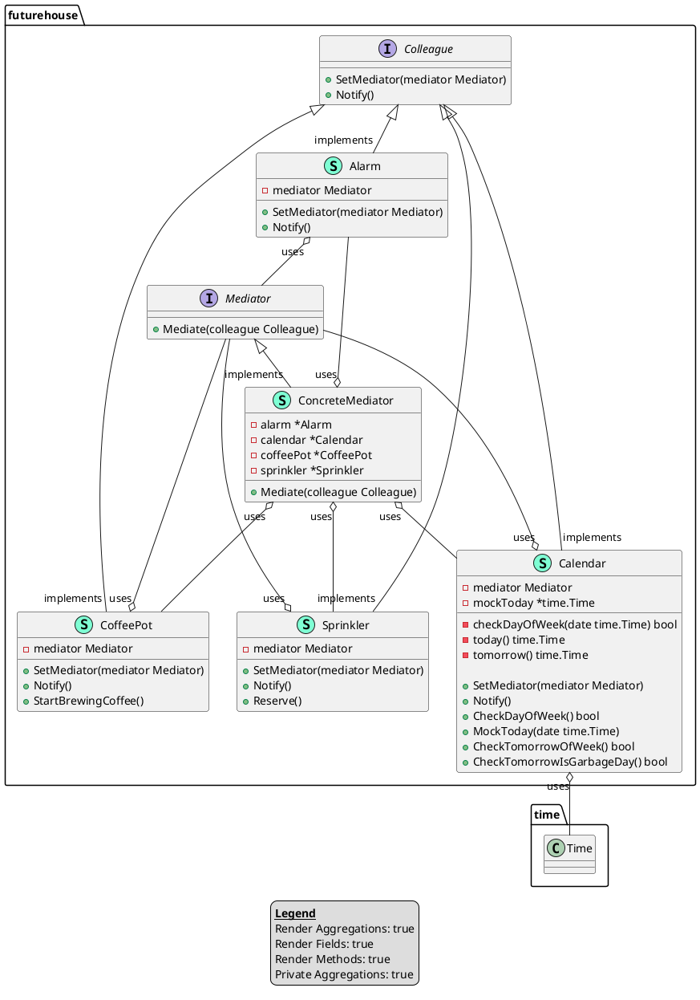
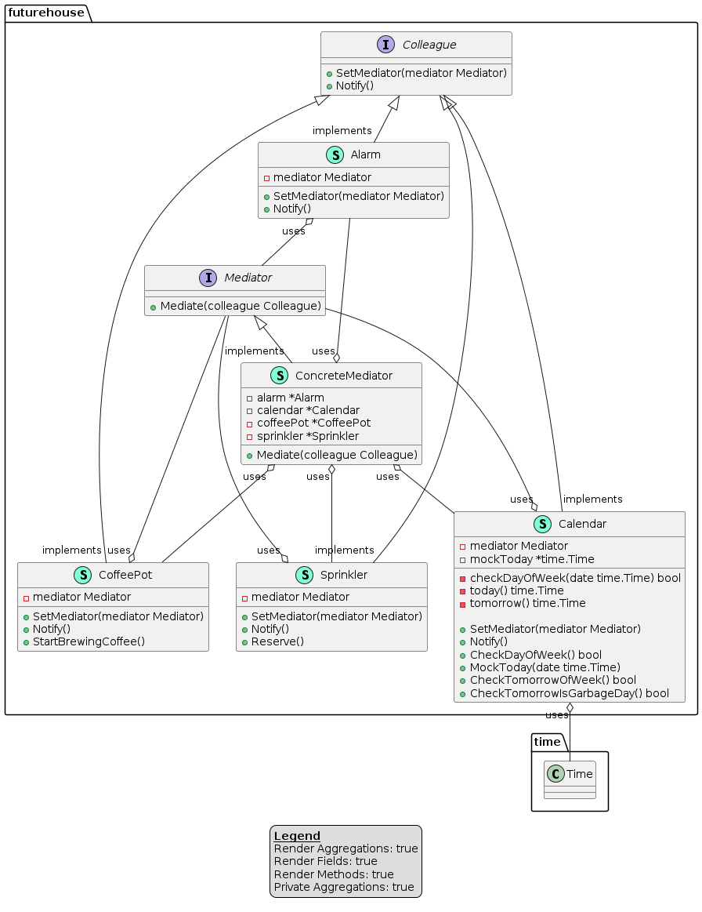

# Mediator 中介者模式

使用中介者模式来集中相关对象之间复杂的沟通和控制方式。

## PlantUML

```plantuml
@startuml
legend
<u><b>Legend</b></u>
Render Aggregations: true
Render Fields: true
Render Methods: true
Private Aggregations: true
end legend
namespace futurehouse {
    class Alarm << (S,Aquamarine) >> {
        - mediator Mediator

        + SetMediator(mediator Mediator) 
        + Notify() 

    }
    class Calendar << (S,Aquamarine) >> {
        - mediator Mediator
        - mockToday *time.Time

        - checkDayOfWeek(date time.Time) bool
        - today() time.Time
        - tomorrow() time.Time

        + SetMediator(mediator Mediator) 
        + Notify() 
        + CheckDayOfWeek() bool
        + MockToday(date time.Time) 
        + CheckTomorrowOfWeek() bool
        + CheckTomorrowIsGarbageDay() bool

    }
    class CoffeePot << (S,Aquamarine) >> {
        - mediator Mediator

        + SetMediator(mediator Mediator) 
        + Notify() 
        + StartBrewingCoffee() 

    }
    interface Colleague  {
        + SetMediator(mediator Mediator) 
        + Notify() 

    }
    class ConcreteMediator << (S,Aquamarine) >> {
        - alarm *Alarm
        - calendar *Calendar
        - coffeePot *CoffeePot
        - sprinkler *Sprinkler

        + Mediate(colleague Colleague) 

    }
    interface Mediator  {
        + Mediate(colleague Colleague) 

    }
    class Sprinkler << (S,Aquamarine) >> {
        - mediator Mediator

        + SetMediator(mediator Mediator) 
        + Notify() 
        + Reserve() 

    }
}

"futurehouse.Colleague" <|-- "implements""futurehouse.Alarm"
"futurehouse.Colleague" <|-- "implements""futurehouse.Calendar"
"futurehouse.Colleague" <|-- "implements""futurehouse.CoffeePot"
"futurehouse.Mediator" <|-- "implements""futurehouse.ConcreteMediator"
"futurehouse.Colleague" <|-- "implements""futurehouse.Sprinkler"

"futurehouse.Alarm""uses" o-- "futurehouse.Mediator"
"futurehouse.Calendar""uses" o-- "futurehouse.Mediator"
"futurehouse.Calendar""uses" o-- "time.Time"
"futurehouse.CoffeePot""uses" o-- "futurehouse.Mediator"
"futurehouse.ConcreteMediator""uses" o-- "futurehouse.Alarm"
"futurehouse.ConcreteMediator""uses" o-- "futurehouse.Calendar"
"futurehouse.ConcreteMediator""uses" o-- "futurehouse.CoffeePot"
"futurehouse.ConcreteMediator""uses" o-- "futurehouse.Sprinkler"
"futurehouse.Sprinkler""uses" o-- "futurehouse.Mediator"

@enduml
```

