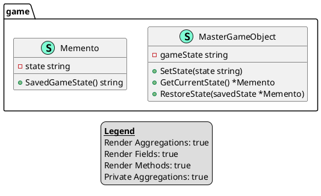
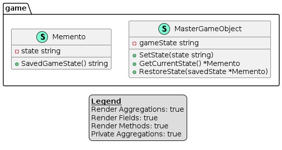

# Memento 备忘录模式

当你需要让对象返回之前的某个状态时，例如，你的用户请求"撤销"，使用备忘录模式。

牢记单一责任原则，保持正在保存的状态和关键对象分离，是个好主意。这个持有状态的、分离的对象，称为备忘录对象。

## 目标

- 保存系统关键对象的重要状态
- 维护关键对象的封装

## PlantUML

```plantuml
@startuml
legend
<u><b>Legend</b></u>
Render Aggregations: true
Render Fields: true
Render Methods: true
Private Aggregations: true
end legend
namespace game {
    class MasterGameObject << (S,Aquamarine) >> {
        - gameState string

        + SetState(state string) 
        + GetCurrentState() *Memento
        + RestoreState(savedState *Memento) 

    }
    class Memento << (S,Aquamarine) >> {
        - state string

        + SavedGameState() string

    }
}

@enduml
```

