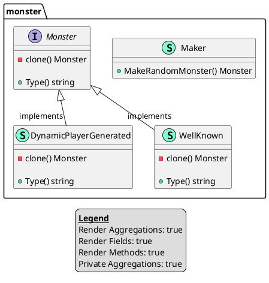
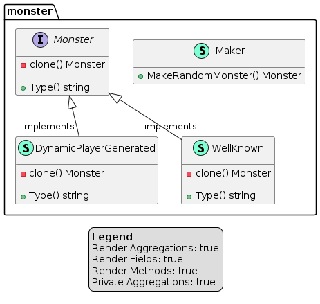

# Prototype 原型模式

当创建给定类的实例昂贵或复杂时，使用原型模式。

原型模式能让你通过复制已有实例来制作新实例（在 Java 中这通常意味着使用 Clone() 方法，或者在需要深度拷贝的时候反序列化）。

## PlantUML

```plantuml
@startuml
legend
<u><b>Legend</b></u>
Render Aggregations: true
Render Fields: true
Render Methods: true
Private Aggregations: true
end legend
namespace monster {
    class DynamicPlayerGenerated << (S,Aquamarine) >> {
        - clone() Monster

        + Type() string

    }
    class Maker << (S,Aquamarine) >> {
        + MakeRandomMonster() Monster

    }
    interface Monster  {
        - clone() Monster

        + Type() string

    }
    class WellKnown << (S,Aquamarine) >> {
        - clone() Monster

        + Type() string

    }
}

"monster.Monster" <|-- "implements""monster.DynamicPlayerGenerated"
"monster.Monster" <|-- "implements""monster.WellKnown"


@enduml
```

