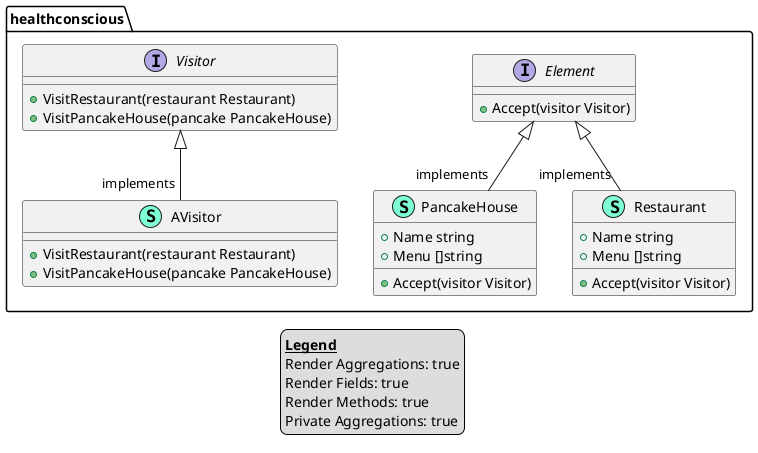

# Visitor 访问者模式

当你想要为一个对象组合增加能力，且封装不重要时，使用访问者模式。

## PlantUML

```plantuml
@startuml
legend
<u><b>Legend</b></u>
Render Aggregations: true
Render Fields: true
Render Methods: true
Private Aggregations: true
end legend
namespace healthconscious {
    class AVisitor << (S,Aquamarine) >> {
        + VisitRestaurant(restaurant Restaurant) 
        + VisitPancakeHouse(pancake PancakeHouse) 

    }
    interface Element  {
        + Accept(visitor Visitor) 

    }
    class PancakeHouse << (S,Aquamarine) >> {
        + Name string
        + Menu []string

        + Accept(visitor Visitor) 

    }
    class Restaurant << (S,Aquamarine) >> {
        + Name string
        + Menu []string

        + Accept(visitor Visitor) 

    }
    interface Visitor  {
        + VisitRestaurant(restaurant Restaurant) 
        + VisitPancakeHouse(pancake PancakeHouse) 

    }
}

"healthconscious.Visitor" <|-- "implements""healthconscious.AVisitor"
"healthconscious.Element" <|-- "implements""healthconscious.PancakeHouse"
"healthconscious.Element" <|-- "implements""healthconscious.Restaurant"


@enduml
```