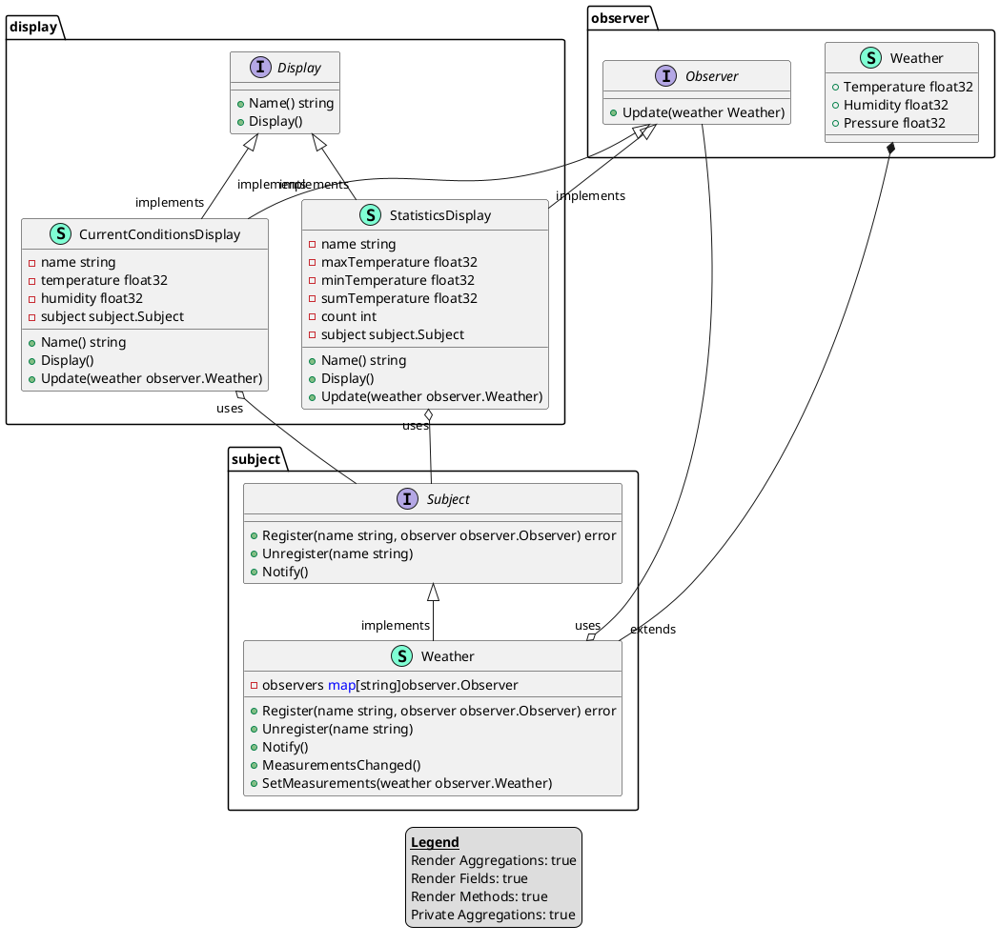
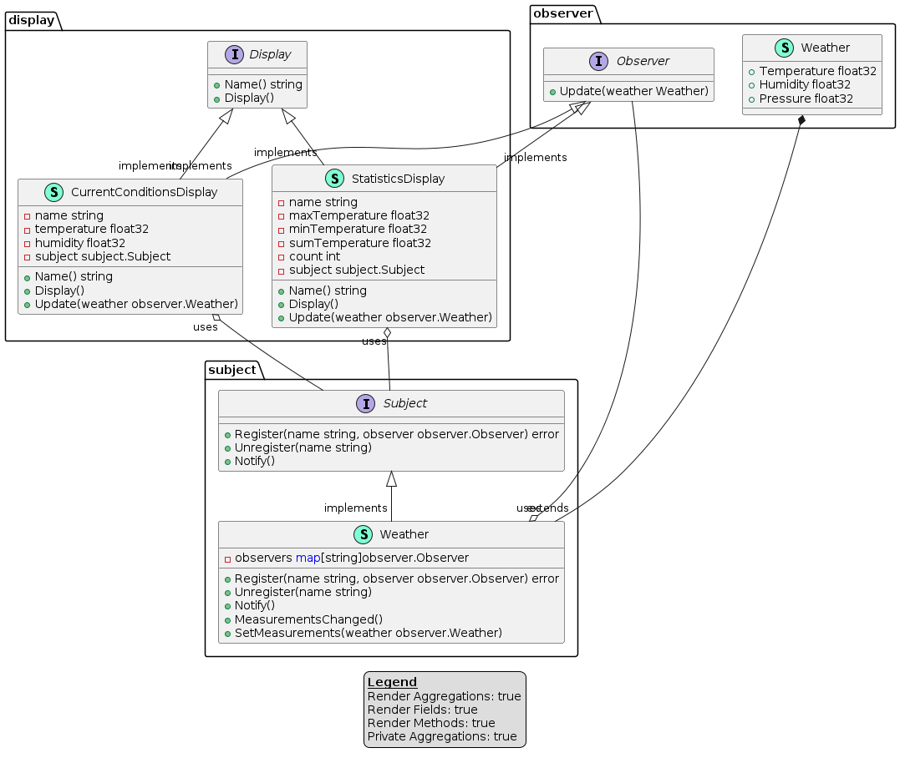

# Observer 观察者模式

观察者模式定义对象之间的一对多依赖，这样一来，当一个对象改变状态时，它的所有依赖者都会收到通知并自动更新

## plantuml

```plantuml
@startuml
legend
<u><b>Legend</b></u>
Render Aggregations: true
Render Fields: true
Render Methods: true
Private Aggregations: true
end legend
namespace display {
    class CurrentConditionsDisplay << (S,Aquamarine) >> {
        - name string
        - temperature float32
        - humidity float32
        - subject subject.Subject

        + Name() string
        + Display() 
        + Update(weather observer.Weather) 

    }
    interface Display  {
        + Name() string
        + Display() 

    }
    class StatisticsDisplay << (S,Aquamarine) >> {
        - name string
        - maxTemperature float32
        - minTemperature float32
        - sumTemperature float32
        - count int
        - subject subject.Subject

        + Name() string
        + Display() 
        + Update(weather observer.Weather) 

    }
}

"display.Display" <|-- "implements""display.CurrentConditionsDisplay"
"observer.Observer" <|-- "implements""display.CurrentConditionsDisplay"
"display.Display" <|-- "implements""display.StatisticsDisplay"
"observer.Observer" <|-- "implements""display.StatisticsDisplay"

"display.CurrentConditionsDisplay""uses" o-- "subject.Subject"
"display.StatisticsDisplay""uses" o-- "subject.Subject"

namespace observer {
    interface Observer  {
        + Update(weather Weather) 

    }
    class Weather << (S,Aquamarine) >> {
        + Temperature float32
        + Humidity float32
        + Pressure float32

    }
}


namespace subject {
    interface Subject  {
        + Register(name string, observer observer.Observer) error
        + Unregister(name string) 
        + Notify() 

    }
    class Weather << (S,Aquamarine) >> {
        - observers <font color=blue>map</font>[string]observer.Observer

        + Register(name string, observer observer.Observer) error
        + Unregister(name string) 
        + Notify() 
        + MeasurementsChanged() 
        + SetMeasurements(weather observer.Weather) 

    }
}
"observer.Weather" *-- "extends""subject.Weather"

"subject.Subject" <|-- "implements""subject.Weather"

"subject.Weather""uses" o-- "observer.Observer"

@enduml
```

