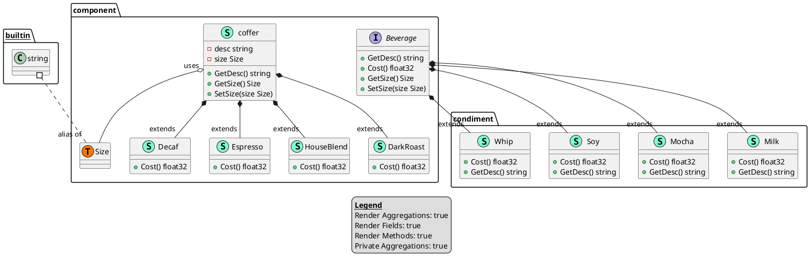

# Decorator 装饰器

装饰器模式动态地将额外责任附加到对象上。对于扩展功能，装饰器提供子类化之外的弹性替代方案。

## plantuml

```plantuml
@startuml
legend
<u><b>Legend</b></u>
Render Aggregations: true
Render Fields: true
Render Methods: true
Private Aggregations: true
end legend
namespace component {
    interface Beverage  {
        + GetDesc() string
        + Cost() float32
        + GetSize() Size
        + SetSize(size Size) 

    }
    class DarkRoast << (S,Aquamarine) >> {
        + Cost() float32

    }
    class Decaf << (S,Aquamarine) >> {
        + Cost() float32

    }
    class Espresso << (S,Aquamarine) >> {
        + Cost() float32

    }
    class HouseBlend << (S,Aquamarine) >> {
        + Cost() float32

    }
    class coffer << (S,Aquamarine) >> {
        - desc string
        - size Size

        + GetDesc() string
        + GetSize() Size
        + SetSize(size Size) 

    }
    class component.Size << (T, #FF7700) >>  {
    }
}
"component.coffer" *-- "extends""component.DarkRoast"
"component.coffer" *-- "extends""component.Decaf"
"component.coffer" *-- "extends""component.Espresso"
"component.coffer" *-- "extends""component.HouseBlend"


"component.coffer""uses" o-- "component.Size"

namespace condiment {
    class Milk << (S,Aquamarine) >> {
        + Cost() float32
        + GetDesc() string

    }
    class Mocha << (S,Aquamarine) >> {
        + Cost() float32
        + GetDesc() string

    }
    class Soy << (S,Aquamarine) >> {
        + Cost() float32
        + GetDesc() string

    }
    class Whip << (S,Aquamarine) >> {
        + Cost() float32
        + GetDesc() string

    }
}
"component.Beverage" *-- "extends""condiment.Milk"
"component.Beverage" *-- "extends""condiment.Mocha"
"component.Beverage" *-- "extends""condiment.Soy"
"component.Beverage" *-- "extends""condiment.Whip"


"__builtin__.string" #.. "alias of""component.Size"
@enduml
```

