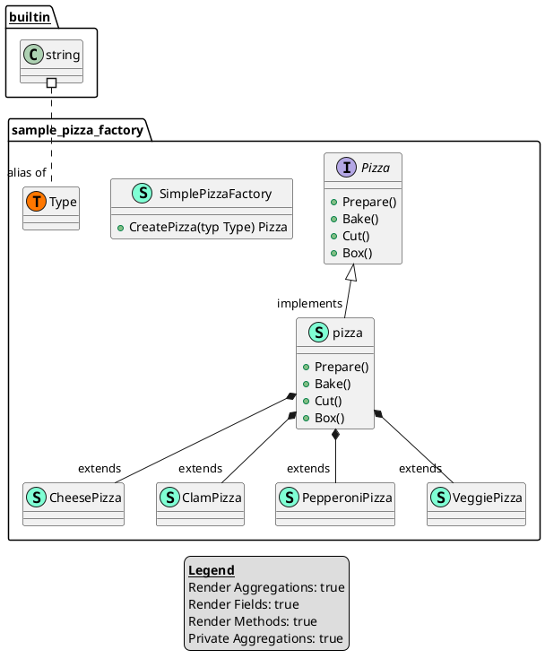

# Factory 工厂模式

## 简单工厂

简单工厂其实不是一个设计模式，更多是一种编程习惯。（但它经常被使用，因此我们给它一个 Head First 模式荣誉奖）

简单工厂虽然不是真正的设计模式，但依然可以作为一个简单的方法，将客户与具体类解耦。

### plantuml

```plantuml
@startuml
legend
<u><b>Legend</b></u>
Render Aggregations: true
Render Fields: true
Render Methods: true
Private Aggregations: true
end legend
namespace sample_pizza_factory {
    class CheesePizza << (S,Aquamarine) >> {
    }
    class ClamPizza << (S,Aquamarine) >> {
    }
    class PepperoniPizza << (S,Aquamarine) >> {
    }
    interface Pizza  {
        + Prepare() 
        + Bake() 
        + Cut() 
        + Box() 

    }
    class SimplePizzaFactory << (S,Aquamarine) >> {
        + CreatePizza(typ Type) Pizza

    }
    class VeggiePizza << (S,Aquamarine) >> {
    }
    class pizza << (S,Aquamarine) >> {
        + Prepare() 
        + Bake() 
        + Cut() 
        + Box() 

    }
    class sample_pizza_factory.Type << (T, #FF7700) >>  {
    }
}
"sample_pizza_factory.pizza" *-- "extends""sample_pizza_factory.CheesePizza"
"sample_pizza_factory.pizza" *-- "extends""sample_pizza_factory.ClamPizza"
"sample_pizza_factory.pizza" *-- "extends""sample_pizza_factory.PepperoniPizza"
"sample_pizza_factory.pizza" *-- "extends""sample_pizza_factory.VeggiePizza"

"sample_pizza_factory.Pizza" <|-- "implements""sample_pizza_factory.pizza"


"__builtin__.string" #.. "alias of""sample_pizza_factory.Type"
@enduml
```

