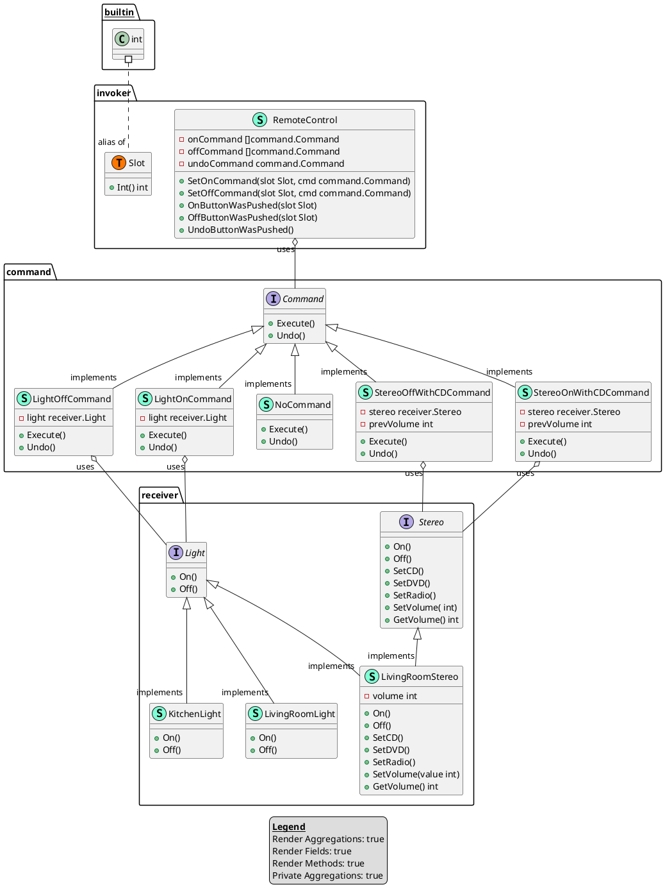
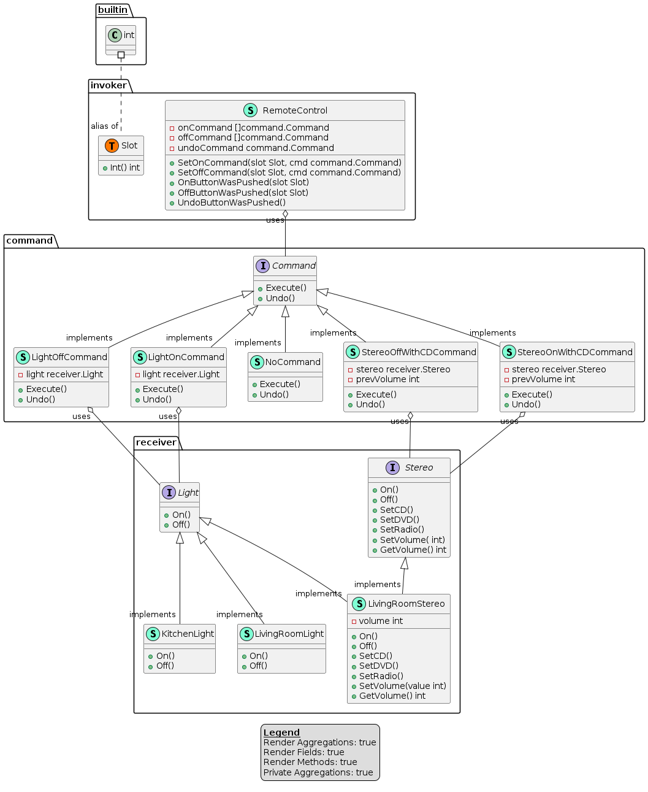

# Command 命令模式

命令模式把请求封装为对象，以便不同的请求、队列或者日志请求来参数化其他对象，并支持可撤销操作。

## plantuml

```plantuml
@startuml
legend
<u><b>Legend</b></u>
Render Aggregations: true
Render Fields: true
Render Methods: true
Private Aggregations: true
end legend
namespace command {
    interface Command  {
        + Execute() 
        + Undo() 

    }
    class LightOffCommand << (S,Aquamarine) >> {
        - light receiver.Light

        + Execute() 
        + Undo() 

    }
    class LightOnCommand << (S,Aquamarine) >> {
        - light receiver.Light

        + Execute() 
        + Undo() 

    }
    class NoCommand << (S,Aquamarine) >> {
        + Execute() 
        + Undo() 

    }
    class StereoOffWithCDCommand << (S,Aquamarine) >> {
        - stereo receiver.Stereo
        - prevVolume int

        + Execute() 
        + Undo() 

    }
    class StereoOnWithCDCommand << (S,Aquamarine) >> {
        - stereo receiver.Stereo
        - prevVolume int

        + Execute() 
        + Undo() 

    }
}

"command.Command" <|-- "implements""command.LightOffCommand"
"command.Command" <|-- "implements""command.LightOnCommand"
"command.Command" <|-- "implements""command.NoCommand"
"command.Command" <|-- "implements""command.StereoOffWithCDCommand"
"command.Command" <|-- "implements""command.StereoOnWithCDCommand"

"command.LightOffCommand""uses" o-- "receiver.Light"
"command.LightOnCommand""uses" o-- "receiver.Light"
"command.StereoOffWithCDCommand""uses" o-- "receiver.Stereo"
"command.StereoOnWithCDCommand""uses" o-- "receiver.Stereo"

namespace invoker {
    class RemoteControl << (S,Aquamarine) >> {
        - onCommand []command.Command
        - offCommand []command.Command
        - undoCommand command.Command

        + SetOnCommand(slot Slot, cmd command.Command) 
        + SetOffCommand(slot Slot, cmd command.Command) 
        + OnButtonWasPushed(slot Slot) 
        + OffButtonWasPushed(slot Slot) 
        + UndoButtonWasPushed() 

    }
    class Slot << (S,Aquamarine) >> {
        + Int() int

    }
    class invoker.Slot << (T, #FF7700) >>  {
    }
}


"invoker.RemoteControl""uses" o-- "command.Command"

namespace receiver {
    class KitchenLight << (S,Aquamarine) >> {
        + On() 
        + Off() 

    }
    interface Light  {
        + On() 
        + Off() 

    }
    class LivingRoomLight << (S,Aquamarine) >> {
        + On() 
        + Off() 

    }
    class LivingRoomStereo << (S,Aquamarine) >> {
        - volume int

        + On() 
        + Off() 
        + SetCD() 
        + SetDVD() 
        + SetRadio() 
        + SetVolume(value int) 
        + GetVolume() int

    }
    interface Stereo  {
        + On() 
        + Off() 
        + SetCD() 
        + SetDVD() 
        + SetRadio() 
        + SetVolume( int) 
        + GetVolume() int

    }
}

"receiver.Light" <|-- "implements""receiver.KitchenLight"
"receiver.Light" <|-- "implements""receiver.LivingRoomLight"
"receiver.Light" <|-- "implements""receiver.LivingRoomStereo"
"receiver.Stereo" <|-- "implements""receiver.LivingRoomStereo"


"__builtin__.int" #.. "alias of""invoker.Slot"
@enduml
```

