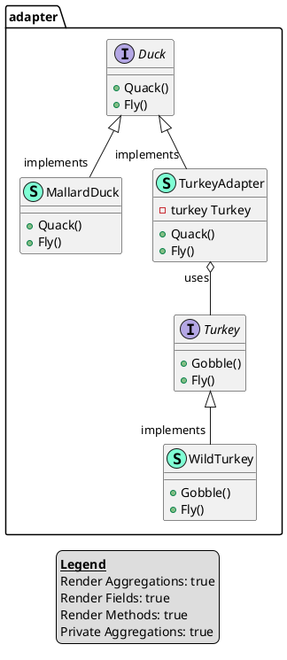
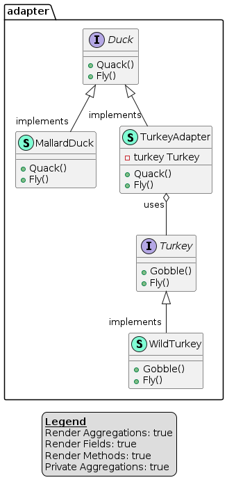

# Adapter 适配器模式

适配器模式将一个类的接口转换成客户期望的另一个接口。适配器让原本接口不兼容的类可以合作。

如果它走路像鸭子，叫起来像鸭子，那么它可能是被鸭子适配器包装的火鸡。

## plantuml

```plantuml
@startuml
legend
<u><b>Legend</b></u>
Render Aggregations: true
Render Fields: true
Render Methods: true
Private Aggregations: true
end legend
namespace adapter {
    interface Duck  {
        + Quack() 
        + Fly() 

    }
    class MallardDuck << (S,Aquamarine) >> {
        + Quack() 
        + Fly() 

    }
    interface Turkey  {
        + Gobble() 
        + Fly() 

    }
    class TurkeyAdapter << (S,Aquamarine) >> {
        - turkey Turkey

        + Quack() 
        + Fly() 

    }
    class WildTurkey << (S,Aquamarine) >> {
        + Gobble() 
        + Fly() 

    }
}

"adapter.Duck" <|-- "implements""adapter.MallardDuck"
"adapter.Duck" <|-- "implements""adapter.TurkeyAdapter"
"adapter.Turkey" <|-- "implements""adapter.WildTurkey"

"adapter.TurkeyAdapter""uses" o-- "adapter.Turkey"

@enduml
```

