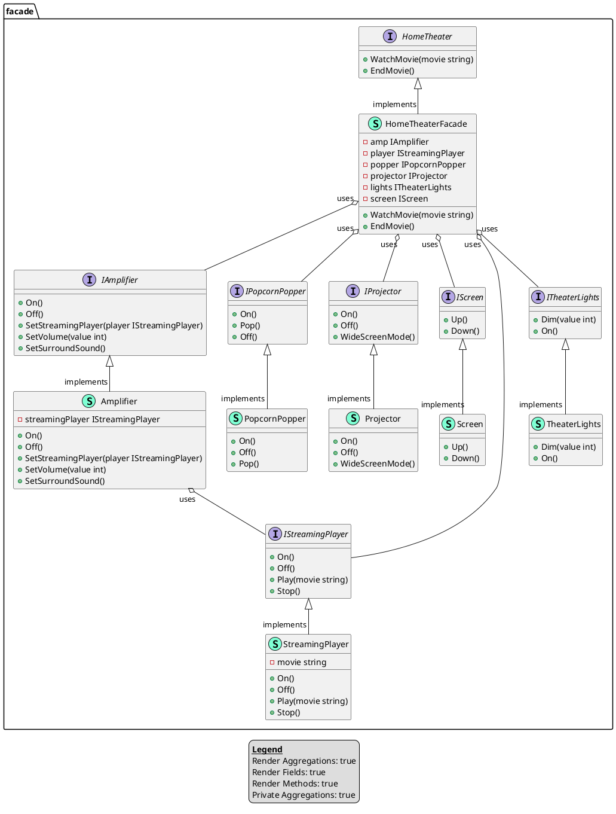
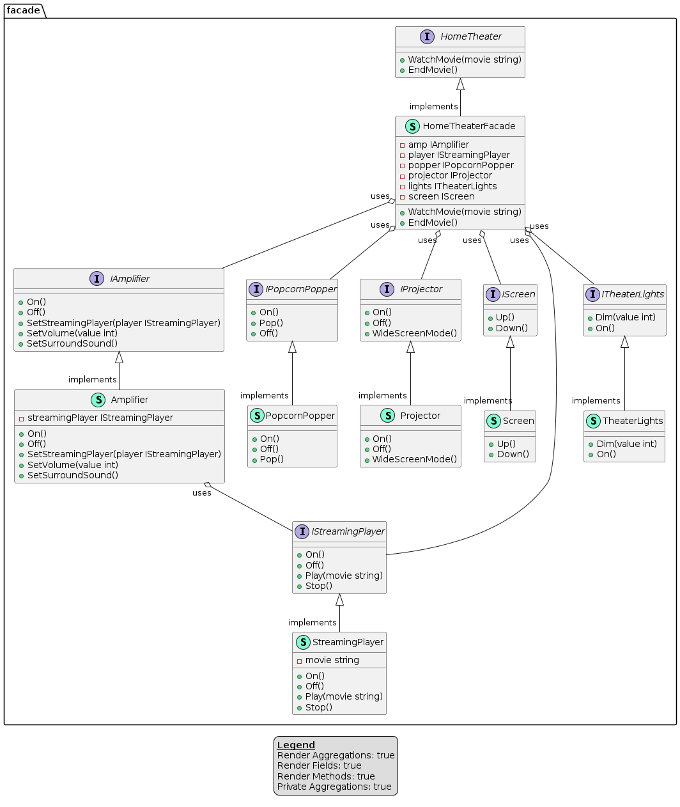

# Facade 外观模式

外观模式为子系统中的一组接口提供了一个统一的接口。外观定义了一个更高级别的接口，使得子系统更容易使用。

外观不仅简化接口，它还把客户从组件的子系统解耦。

## plantuml

```plantuml
@startuml
legend
<u><b>Legend</b></u>
Render Aggregations: true
Render Fields: true
Render Methods: true
Private Aggregations: true
end legend
namespace facade {
    class Amplifier << (S,Aquamarine) >> {
        - streamingPlayer IStreamingPlayer

        + On() 
        + Off() 
        + SetStreamingPlayer(player IStreamingPlayer) 
        + SetVolume(value int) 
        + SetSurroundSound() 

    }
    interface HomeTheater  {
        + WatchMovie(movie string) 
        + EndMovie() 

    }
    class HomeTheaterFacade << (S,Aquamarine) >> {
        - amp IAmplifier
        - player IStreamingPlayer
        - popper IPopcornPopper
        - projector IProjector
        - lights ITheaterLights
        - screen IScreen

        + WatchMovie(movie string) 
        + EndMovie() 

    }
    interface IAmplifier  {
        + On() 
        + Off() 
        + SetStreamingPlayer(player IStreamingPlayer) 
        + SetVolume(value int) 
        + SetSurroundSound() 

    }
    interface IPopcornPopper  {
        + On() 
        + Pop() 
        + Off() 

    }
    interface IProjector  {
        + On() 
        + Off() 
        + WideScreenMode() 

    }
    interface IScreen  {
        + Up() 
        + Down() 

    }
    interface IStreamingPlayer  {
        + On() 
        + Off() 
        + Play(movie string) 
        + Stop() 

    }
    interface ITheaterLights  {
        + Dim(value int) 
        + On() 

    }
    class PopcornPopper << (S,Aquamarine) >> {
        + On() 
        + Off() 
        + Pop() 

    }
    class Projector << (S,Aquamarine) >> {
        + On() 
        + Off() 
        + WideScreenMode() 

    }
    class Screen << (S,Aquamarine) >> {
        + Up() 
        + Down() 

    }
    class StreamingPlayer << (S,Aquamarine) >> {
        - movie string

        + On() 
        + Off() 
        + Play(movie string) 
        + Stop() 

    }
    class TheaterLights << (S,Aquamarine) >> {
        + Dim(value int) 
        + On() 

    }
}

"facade.IAmplifier" <|-- "implements""facade.Amplifier"
"facade.HomeTheater" <|-- "implements""facade.HomeTheaterFacade"
"facade.IPopcornPopper" <|-- "implements""facade.PopcornPopper"
"facade.IProjector" <|-- "implements""facade.Projector"
"facade.IScreen" <|-- "implements""facade.Screen"
"facade.IStreamingPlayer" <|-- "implements""facade.StreamingPlayer"
"facade.ITheaterLights" <|-- "implements""facade.TheaterLights"

"facade.Amplifier""uses" o-- "facade.IStreamingPlayer"
"facade.HomeTheaterFacade""uses" o-- "facade.IAmplifier"
"facade.HomeTheaterFacade""uses" o-- "facade.IPopcornPopper"
"facade.HomeTheaterFacade""uses" o-- "facade.IProjector"
"facade.HomeTheaterFacade""uses" o-- "facade.IScreen"
"facade.HomeTheaterFacade""uses" o-- "facade.IStreamingPlayer"
"facade.HomeTheaterFacade""uses" o-- "facade.ITheaterLights"

@enduml
```

