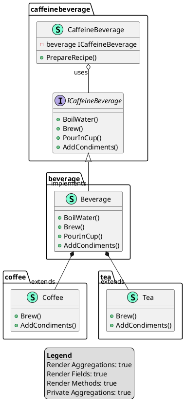
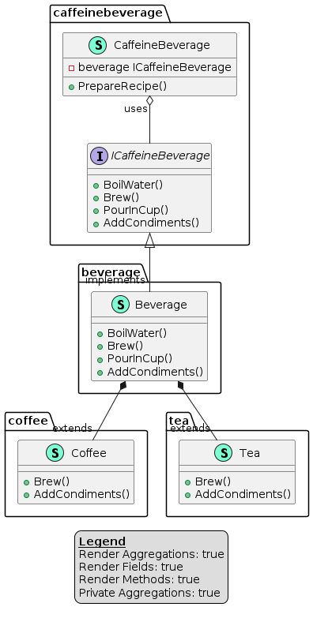

# TemplateMethod 模版方法模式

模版方法模式在一个方法中定义一个算法的骨架，而把一些步骤延迟到子类。模版方法使得子类可以在不改变算法结构的情况下，重新定义算法中的某些步骤。

## plantuml

```plantuml
@startuml
legend
<u><b>Legend</b></u>
Render Aggregations: true
Render Fields: true
Render Methods: true
Private Aggregations: true
end legend
namespace beverage {
    class Beverage << (S,Aquamarine) >> {
        + BoilWater() 
        + Brew() 
        + PourInCup() 
        + AddCondiments() 

    }
}

"caffeinebeverage.ICaffeineBeverage" <|-- "implements""beverage.Beverage"


namespace caffeinebeverage {
    class CaffeineBeverage << (S,Aquamarine) >> {
        - beverage ICaffeineBeverage

        + PrepareRecipe() 

    }
    interface ICaffeineBeverage  {
        + BoilWater() 
        + Brew() 
        + PourInCup() 
        + AddCondiments() 

    }
}


"caffeinebeverage.CaffeineBeverage""uses" o-- "caffeinebeverage.ICaffeineBeverage"

namespace coffee {
    class Coffee << (S,Aquamarine) >> {
        + Brew() 
        + AddCondiments() 

    }
}
"beverage.Beverage" *-- "extends""coffee.Coffee"


namespace tea {
    class Tea << (S,Aquamarine) >> {
        + Brew() 
        + AddCondiments() 

    }
}
"beverage.Beverage" *-- "extends""tea.Tea"


@enduml
```

