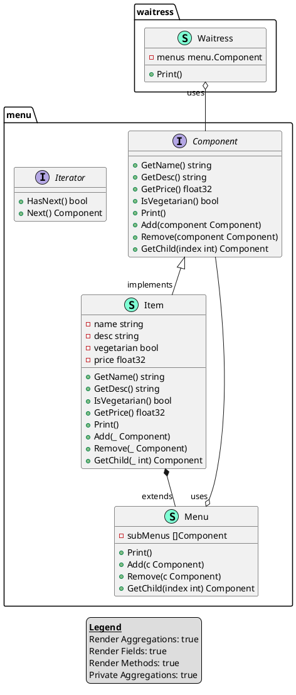
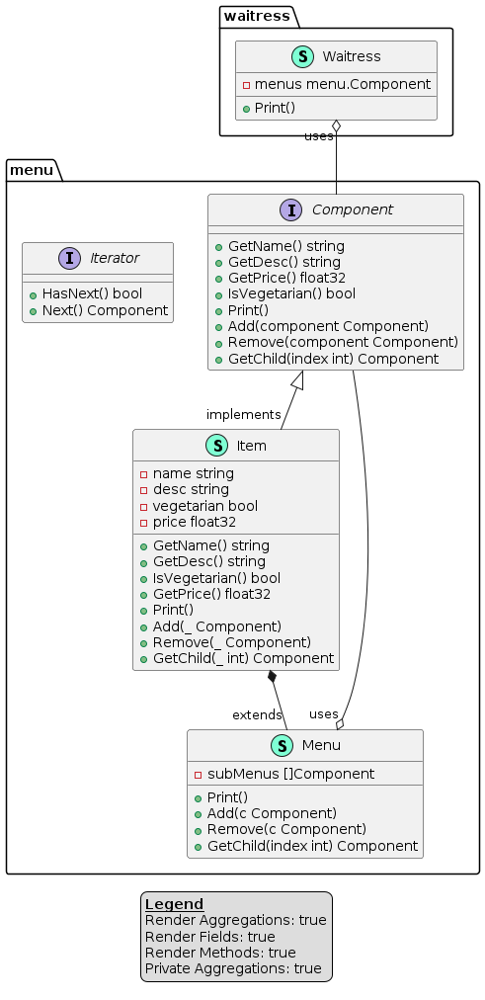

# Composite 组合模式

组合模式允许你将对象组合成树形结构来表现 `部分-整体` 层次结构。组合让客户可以统一处理个别对象和对象的组合。

## plantuml

```plantuml
@startuml
legend
<u><b>Legend</b></u>
Render Aggregations: true
Render Fields: true
Render Methods: true
Private Aggregations: true
end legend
namespace menu {
    interface Component  {
        + GetName() string
        + GetDesc() string
        + GetPrice() float32
        + IsVegetarian() bool
        + Print() 
        + Add(component Component) 
        + Remove(component Component) 
        + GetChild(index int) Component

    }
    class Item << (S,Aquamarine) >> {
        - name string
        - desc string
        - vegetarian bool
        - price float32

        + GetName() string
        + GetDesc() string
        + IsVegetarian() bool
        + GetPrice() float32
        + Print() 
        + Add(_ Component) 
        + Remove(_ Component) 
        + GetChild(_ int) Component

    }
    interface Iterator  {
        + HasNext() bool
        + Next() Component

    }
    class Menu << (S,Aquamarine) >> {
        - subMenus []Component

        + Print() 
        + Add(c Component) 
        + Remove(c Component) 
        + GetChild(index int) Component

    }
}
"menu.Item" *-- "extends""menu.Menu"

"menu.Component" <|-- "implements""menu.Item"

"menu.Menu""uses" o-- "menu.Component"

namespace waitress {
    class Waitress << (S,Aquamarine) >> {
        - menus menu.Component

        + Print() 

    }
}


"waitress.Waitress""uses" o-- "menu.Component"

@enduml
```

