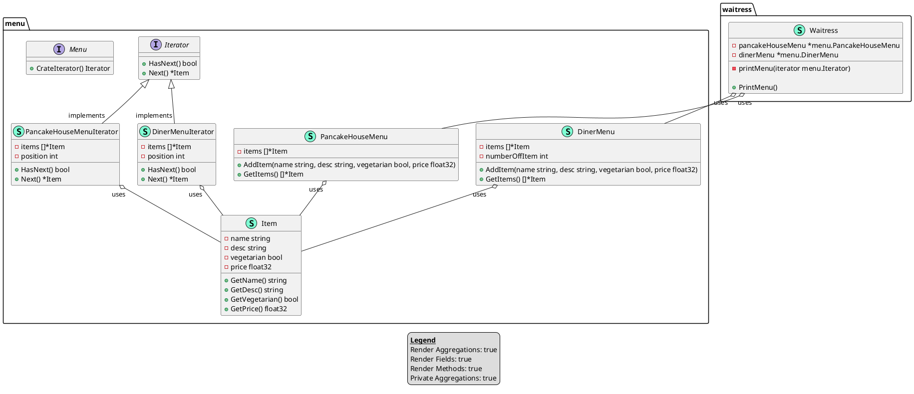
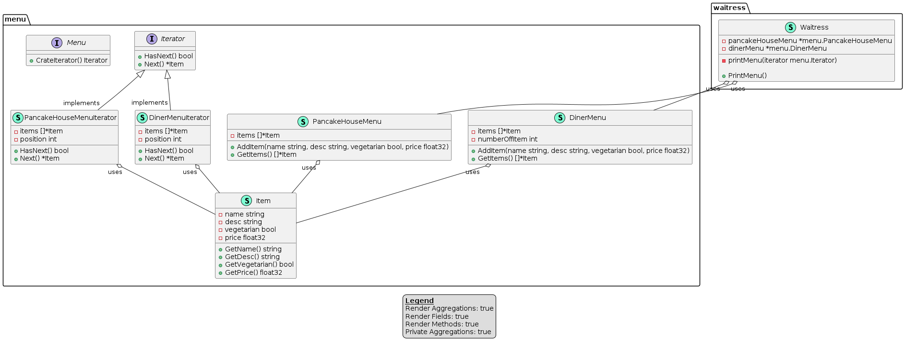

# Iterator 迭代器模式

迭代器模式提供一种方法，可以访问一个聚合对象中的元素而又不暴露其潜在的表示。

## plantuml

```plantuml
@startuml
legend
<u><b>Legend</b></u>
Render Aggregations: true
Render Fields: true
Render Methods: true
Private Aggregations: true
end legend
namespace menu {
    class DinerMenu << (S,Aquamarine) >> {
        - items []*Item
        - numberOffItem int

        + AddItem(name string, desc string, vegetarian bool, price float32) 
        + GetItems() []*Item

    }
    class DinerMenuIterator << (S,Aquamarine) >> {
        - items []*Item
        - position int

        + HasNext() bool
        + Next() *Item

    }
    class Item << (S,Aquamarine) >> {
        - name string
        - desc string
        - vegetarian bool
        - price float32

        + GetName() string
        + GetDesc() string
        + GetVegetarian() bool
        + GetPrice() float32

    }
    interface Iterator  {
        + HasNext() bool
        + Next() *Item

    }
    interface Menu  {
        + CrateIterator() Iterator

    }
    class PancakeHouseMenu << (S,Aquamarine) >> {
        - items []*Item

        + AddItem(name string, desc string, vegetarian bool, price float32) 
        + GetItems() []*Item

    }
    class PancakeHouseMenuIterator << (S,Aquamarine) >> {
        - items []*Item
        - position int

        + HasNext() bool
        + Next() *Item

    }
}

"menu.Iterator" <|-- "implements""menu.DinerMenuIterator"
"menu.Iterator" <|-- "implements""menu.PancakeHouseMenuIterator"

"menu.DinerMenu""uses" o-- "menu.Item"
"menu.DinerMenuIterator""uses" o-- "menu.Item"
"menu.PancakeHouseMenu""uses" o-- "menu.Item"
"menu.PancakeHouseMenuIterator""uses" o-- "menu.Item"

namespace waitress {
    class Waitress << (S,Aquamarine) >> {
        - pancakeHouseMenu *menu.PancakeHouseMenu
        - dinerMenu *menu.DinerMenu

        - printMenu(iterator menu.Iterator) 

        + PrintMenu() 

    }
}


"waitress.Waitress""uses" o-- "menu.DinerMenu"
"waitress.Waitress""uses" o-- "menu.PancakeHouseMenu"

@enduml
```

